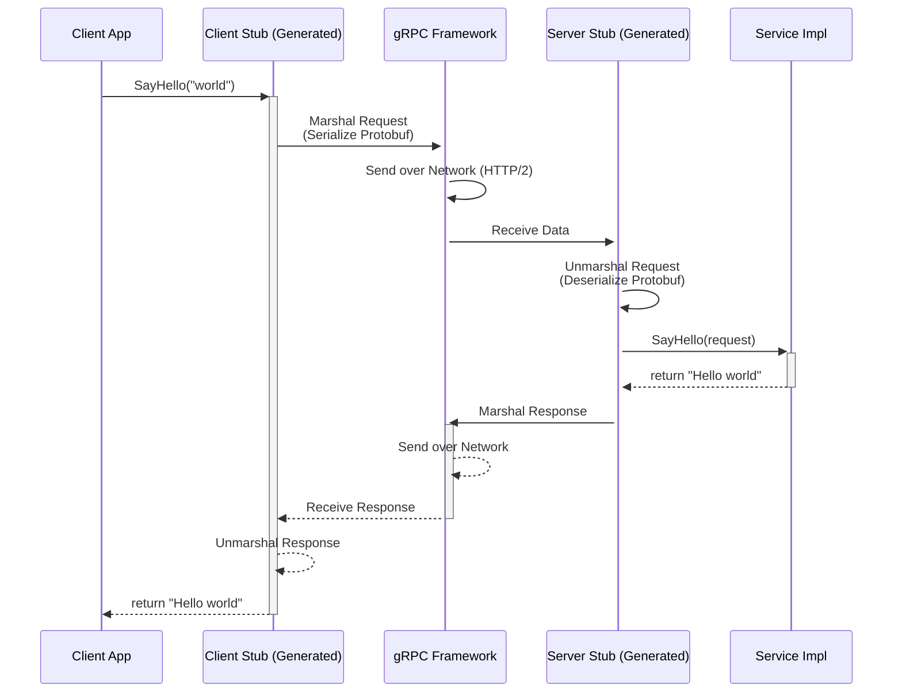
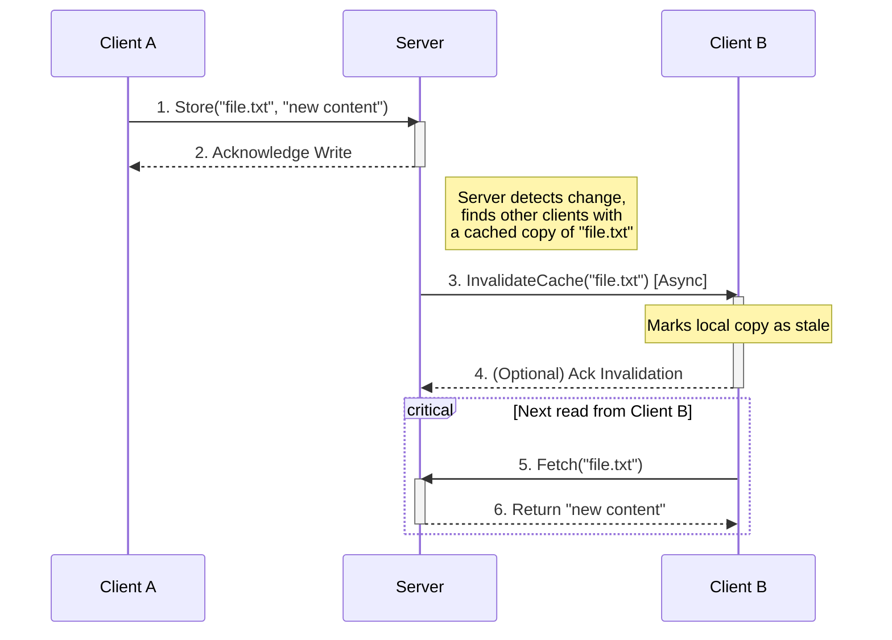

## Introduction

Distributed systems are fundamental to modern computing, enabling data sharing, fault tolerance, and scalability. One key component of distributed computing is the **Distributed File System (DFS)**, which allows multiple clients to access and modify files remotely while ensuring data consistency.

In this post, I'll explore key concepts learned while building a DFS, focusing on remote procedure calls (RPC), consistency models, and synchronization mechanisms. These concepts have wide applications in cloud computing, distributed storage, and large-scale data processing.

## The Role of Remote Procedure Calls in Distributed Systems

A distributed system requires efficient communication between different nodes. **Remote Procedure Calls (RPC)** provide a structured way for processes to invoke functions on remote machines as if they were local. Instead of manually handling low-level socket programming, RPC frameworks abstract networking complexities, enabling smooth data exchange.

For this project, **gRPC** was used as the RPC framework, along with **Protocol Buffers (protobufs)** for data serialization. gRPC facilitates bidirectional communication with built-in support for authentication, streaming, and deadline handling.

### Key Takeaways:
- **Why RPC?** It simplifies inter-process communication, reducing the complexity of network programming.
- **Why gRPC?** It offers language-agnostic APIs, efficient serialization, and asynchronous communication capabilities.
- **Importance of Deadlines and Timeouts:** Handling server timeouts ensures that clients do not remain stuck waiting indefinitely.

## Ensuring Consistency in a Distributed File System

One of the most significant challenges in DFS design is maintaining consistency across multiple clients accessing the same files. There are different approaches to handling consistency, ranging from **strong consistency** (ensuring all clients see the same data immediately) to **eventual consistency** (allowing temporary discrepancies that resolve over time).

This project implemented a **weak consistency model**, similar to the **Andrew File System (AFS)**, where:
- Clients maintain **local caches** of files to improve performance.
- A **write-lock mechanism** ensures that only one client can modify a file at a time.
- Clients and servers synchronize file changes based on timestamps and checksums.

### Key Takeaways:
- **Trade-offs in Consistency Models:** Strong consistency improves correctness but can lead to high latency. Weak consistency provides better performance but requires synchronization mechanisms.
- **Write Locks Prevent Conflicts:** Ensuring that only one client writes at a time helps maintain data integrity.
- **Change Detection via Checksums:** Using hash functions like CRC32 helps detect file modifications efficiently.

## Synchronization and Change Propagation

In a distributed file system, file modifications must be propagated efficiently across clients. This project implemented two key synchronization mechanisms:

1. **Client-Side File Watcher:**
   - Used system notifications (`inotify`) to detect local file modifications.
   - Notified the server when files changed, ensuring updates were pushed promptly.

2. **Asynchronous Server Callbacks:**
   - The server broadcasted file updates to connected clients.
   - Clients reacted accordingly—fetching updated files or deleting outdated ones.

### Key Takeaways:
- **Event-Driven Updates Reduce Polling Overhead:** Instead of continuously checking for changes, clients receive notifications only when necessary.
- **Synchronization Must Handle Concurrent Events:** Clients and servers must manage concurrent modifications safely to avoid inconsistencies.
- **Asynchronous Communication Improves Efficiency:** Clients do not block execution while waiting for updates, enabling better scalability.

{/* <Figure
  caption="The Remote Procedure Call (RPC) flow. The client call is marshalled, sent over the network, and unmarshalled by the server stub, which then invokes the actual service implementation. The process is reversed for the response."
> */}

{/* </Figure> */}

## Broader Implications and Applications

The concepts explored in this project have real-world applications in:
- **Cloud Storage Services** (e.g., Google Drive, Dropbox) where multiple users edit shared files.
- **Distributed Databases** that replicate data across nodes while maintaining consistency.
- **Big Data Processing** frameworks that distribute large files across multiple servers for analysis.

### Final Thoughts
This project highlighted the importance of designing distributed systems that balance **performance, consistency, and reliability**. Whether working on cloud storage, large-scale computing, or real-time collaboration tools, the principles of **remote communication, synchronization, and consistency** are crucial for building scalable and robust solutions.

{/* <Figure
    caption="Weak consistency with cache invalidation. A write from Client A updates the server, which then asynchronously tells Client B that its cached copy is stale. Client B will fetch the new version on its next read."
> */}

{/* </Figure> */}

## Additional resources

- [GIOS Course Website](https://omscs.gatech.edu/cs-6200-introduction-operating-systems)
- [Linux Programming Interface](https://man7.org/tlpi/)
- [Operating Systems: Three Easy Pieces](https://pages.cs.wisc.edu/~remzi/OSTEP/)
- [C++ Concurrency in Action](https://www.manning.com/books/c-plus-plus-concurrency-in-action)
- [gRPC C++ Quickstart](https://grpc.io/docs/languages/cpp/quickstart/)
- [A Tour of C++, 3rd Edition](https://www.stroustrup.com/tour3.html)
