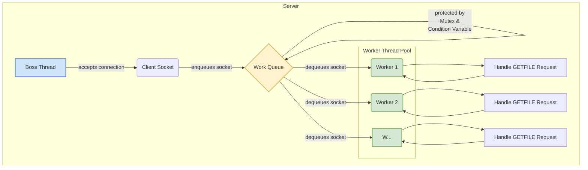

import { Image } from "astro:assets";
import Figure from "../../../../components/Figure.astro";
import clientServer from "./client-server.png";
import userKernelSocket from "./user-kernel-socket.png";
import getfileProtocol from "./getfile-protocol.png";

## Introduction: The Challenge

Ever wondered what *really* happens when you click a download link? It seems like magic. You click, and a file appears. But behind that simple action lies a carefully orchestrated conversation between computers, a conversation refereed by their operating systems. For my first project in Georgia Tech's Graduate Introduction to Operating Systems (CS 6200), I had to build one side of that conversation: a multithreaded file server, from scratch, in C.

The goal was to implement a server capable of handling multiple file requests simultaneously. This wasn't just about writing code; it was about a head-first dive into the core concepts that make the modern internet possible: network sockets, system calls, concurrency, and protocol design.

Going in, I was comfortable with C's syntax but had never touched the Berkeley socket API. Networking was a black box I'd only ever interacted with through the convenient abstractions like Python's `requests` library. This project was my opportunity to pry open that box. This post documents that journey, not just what I built, but the fundamental *whys* behind the code.

## The Foundation: Client-Server & Network Models

At its heart, network communication is a conversation. The most common pattern for this conversation is the **client-server model**. It's a simple idea: a **client** (like your web browser) needs something, and a **server** (like the computer hosting `google.com`) has something to provide. The client initiates the conversation, and the server responds.

<Figure
  src={clientServer}
  alt="TCP/IP Model"
  caption="The TCP/IP model is a 4-layer stack, and for this project, we're mostly concerned with two: the application layer and the transport layer."
/>

But for this conversation to work, both sides need to speak the same language and follow the same rules. The **TCP/IP model** provides this rulebook. It's a 4-layer stack, and for this project, we're mostly concerned with two:

1.  **Application Layer:** This is where our custom application logic lives. We define the *meaning* of the conversation. For web browsers, this is HTTP (`GET /index.html...`).
2.  **Transport Layer:** This layer is responsible for the reliability of the connection. We primarily use the **Transmission Control Protocol (TCP)**. For sending a file, TCP is the perfect choice. It's *connection-oriented* (the client and server maintain a connection for the duration of the transfer) and *reliable* (it guarantees that all the bytes you send will arrive at the destination, and in the correct order). The alternative, UDP, is faster but "fire-and-forget"—not ideal when you can't afford to lose a single byte of your file.

The Operating System handles the lower layers (Network and Link), managing the messy details of IP addresses and routing data across the physical network. Our application code, thankfully, doesn't have to worry about that. Instead, it talks to the Transport Layer through an interface provided by the OS: a socket.

### Sockets: The OS Gateway to the Network

A **socket** is one of the most powerful abstractions in modern computing. It's a special kind of file descriptor that represents a connection endpoint. Think of it like a phone jack in the wall. As an application developer, you don't need to know about the complex wiring inside the wall (the TCP/IP stack, the network card drivers); you just need to know how to plug your "phone" into the jack to start a conversation.

This abstraction is necessary because network hardware is a protected resource. Your user-level application can't just write bytes to the network card directly. That would be chaos. Instead, you have to ask the OS to do it for you. This is accomplished via **system calls**.

<Figure 
  src={userKernelSocket} 
  width={600}
  alt="User-space application communicating with kernel through sockets"
  caption="When your program calls send(), it's a request to the OS kernel. The CPU switches from User Mode to Kernel Mode, where the kernel handles the network communication."
/>

When your program calls a function like `send()`, it's not an ordinary function call. It's a request to the OS kernel. The CPU switches from **User Mode** to **Kernel Mode**, a privileged state where it has full access to the hardware. The kernel takes your data, breaks it into packets, adds the necessary TCP/IP headers, and sends it to the network card. This user/kernel separation is a fundamental security and stability feature of all modern operating systems.

### The Socket API in Action (C)

The API for using sockets is direct and explicit. Here's a conceptual overview of the key API calls for a simple server and client. This simple example follows [Beej's Guide to Network Programming](https://beej.us/guide/bgnet/html/#sendrecv), which was a great resource for this project.

**Server Lifecycle:**

```c
// 1. Create the socket
int server_fd = socket(AF_INET, SOCK_STREAM, 0);

// 2. Bind the socket to an address and port
struct sockaddr_in address;
// ... setup address struct ...
bind(server_fd, (struct sockaddr *)&address, sizeof(address));

// 3. Listen for incoming connections
listen(server_fd, 5); // 5 is the backlog size

// 4. Accept a new connection (this blocks until a client connects)
int client_fd = accept(server_fd, NULL, NULL);

// 5. Communicate with the client
char buffer[1024] = {0};
recv(client_fd, buffer, 1024, 0);
send(client_fd, "Hello from server", 16, 0);

// 6. Close the connection
close(client_fd);
```

**Client Lifecycle:**
```c
// 1. Create the socket
int client_fd = socket(AF_INET, SOCK_STREAM, 0);

// 2. Specify server address to connect to
struct sockaddr_in serv_addr;
// ... setup server address struct ...

// 3. Connect to the server
connect(client_fd, (struct sockaddr *)&serv_addr, sizeof(serv_addr));

// 4. Communicate
send(client_fd, "Hello from client", 16, 0);
recv(client_fd, buffer, 1024, 0);

// 5. Close the connection
close(client_fd);
```
The server's flow is more complex because it has a "listening" socket that acts as a factory, creating a *new* socket for each client connection it accepts.

### The `GETFILE` Protocol

With the ability to send and receive bytes, I needed to give those bytes meaning. I implemented a simple HTTP-like protocol called `GETFILE`, which was specified in the project. Working with a bespoke protocol, no matter how simple, is a fantastic exercise. It forces you to think about ambiguity, parsing, and error handling with raw byte streams.

<Figure
  src={getfileProtocol}
  alt="GETFILE Protocol"
  caption="The GETFILE protocol is a simple HTTP-like protocol that is used to request files from the server."
/>

The protocol specification from the project is strict and resembles a simplified version of HTTP/1.0.

<details>
  <summary>Expand to see more details about the GETFILE protocol including the client request, server response, and error handling:</summary>
  

#### Client Request

The client sends a single request header, terminated by a `\r\n\r\n` sequence.

```
GETFILE GET /<path>\r\n\r\n
```

-   **Scheme:** Always `GETFILE`.
-   **Method:** Always `GET`.
-   **Path:** The path to the requested file, which must begin with a `/`.
-   **Terminator:** A specific four-byte sequence: carriage return, newline, carriage return, newline. This marks the end of the header.

#### Server Response

The server's response also consists of a header, and if successful, a body.

A successful response looks like this:

```
GETFILE OK <length>\r\n\r\n<content>
```

-   **Scheme:** Always `GETFILE`.
-   **Status:** `OK` for a successful request.
-   **Length:** The size of the file in bytes, represented as an ASCII string.
-   **Header Terminator:** The `\r\n\r\n` sequence separates the header from the file's content.
-   **Content:** The raw bytes of the file. The client must read exactly `length` bytes from the socket.

#### Handling Errors

A robust protocol must clearly define its error states. `GETFILE` has three:
-   `FILE_NOT_FOUND`: The request was valid, but the file doesn't exist on the server.
-   `INVALID`: The client sent a malformed request (e.g., wrong scheme, missing spaces, incomplete header).
-   `ERROR`: An unexpected error occurred on the server side (e.g., could not read the file due to permissions).

For any of these statuses, the server sends a single header line with no body content:

```
GETFILE <status>\r\n\r\n
```
For example: `GETFILE FILE_NOT_FOUND\r\n\r\n`.

</details>

### A Note on C Strings
A crucial and challenging part of implementing this in C is that the received data is **not null-terminated**. A buffer from `recv()` is just a sequence of bytes. You cannot use standard string functions like `strcpy` or `strstr` on it directly without risking reading past the buffer's boundary. Parsing requires careful, manual inspection of the bytes, searching for the spaces and the final `\r\n\r\n` sequence. This was a fantastic, if sometimes frustrating, lesson in the difference between a C "string" and a raw byte array.

## Scaling Up: The Move to Multithreading

The initial, single-threaded server worked, but it had a huge flaw: it could only handle one client at a time. If one client requested a very large file, every other client had to wait in line. This does not scale.

The solution, mandated by the project, was to build a **multithreaded** server using the `pthreads` library, following the **Boss/Worker** design pattern.

*   **The Boss Thread (Main Thread):** This thread's only job is to `accept()` new client connections. When a new connection is made, the Boss doesn't handle the client itself. Instead, it places the client's socket file descriptor into a shared work queue (the project provided a `steque` library for this).
*   **Worker Threads:** A pool of worker threads is created when the server starts. They wait for work to appear in the queue. When a descriptor is added, one worker wakes up, takes the job, and handles the entire `GETFILE` transaction. Once it's done, it closes the client socket and goes back to waiting for more work.

This model is powerful, but it introduces the classic challenges of concurrency.

### The Danger Zone: Concurrency, Mutexes, and Condition Variables

The work queue is shared memory. If the Boss thread tries to add to the queue at the same time a Worker is trying to remove from it, you get a **race condition** that can corrupt the queue's state, leading to crashes or bizarre bugs.

To solve this, you must protect the shared data. The project required using two key mechanisms from `pthreads`:

1.  **Mutexes (`pthread_mutex_t`):** A mutex (short for **mut**ual **ex**clusion) acts as a lock. Before accessing the queue (the *critical section*), a thread must acquire the lock. If another thread already holds it, the thread will block until the lock is released. This ensures only one thread can modify the queue at a time.

2.  **Condition Variables (`pthread_cond_t`):** But what should a worker do if it locks the queue and finds it's empty? It could unlock and then immediately try to lock again in a tight loop. This "busy-waiting" burns CPU cycles for no reason. A much more elegant solution is a condition variable. It allows threads to sleep efficiently until there's a reason to wake up.

The correct pattern looks like this:

*   **Worker Thread (Consumer):**
    1.  Lock the mutex.
    2.  While the queue is empty, call `pthread_cond_wait()`. This special function atomically unlocks the mutex and puts the thread to sleep.
    3.  When woken up, it automatically re-acquires the lock. It then grabs a job from the queue.
    4.  Unlock the mutex.
    5.  Process the job (this happens outside the lock, allowing other threads to access the queue).

*   **Boss Thread (Producer):**
    1.  Lock the mutex.
    2.  Add a new job to the queue.
    3.  Call `pthread_cond_signal()` to wake up *one* of the sleeping worker threads.
    4.  Unlock the mutex.

Getting this interaction between mutexes and condition variables right was the hardest, and most rewarding, part of the project. It's the core pattern for nearly all producer-consumer problems in concurrent programming.



## Building and Testing

A C project of this complexity demands proper tooling for building and testing.

*   **Environment:** The project had specific Linux dependencies, so I used **Vagrant** to create a consistent, reproducible virtual machine, mirroring the official testing environment. This saved me from countless "works on my machine" headaches.
*   **Build System:** You can't just run `gcc` over and over. A `Makefile` is essential. It automates the process of compiling, linking, and cleaning up object files. It's also the perfect place to store compiler flags like `-Wall` (turn on all warnings), `-g` (include debugging symbols), and `-pthread` (link the pthreads library).
*   **Automated and Stress Testing:** How do you know your server *really* works? You write tests—and not just simple ones. The best way to test a server is to write a client in a completely different language, which forces you to follow your protocol specification to the letter. I used Python and `pytest` (with its `socket` library, a thin wrapper around the same C APIs) to build a test suite that connected to my C server and exercised a range of scenarios: successful file downloads, requests for non-existent files, and malformed protocol requests, all while asserting that the server's responses were byte-for-byte compliant with the `GETFILE` specification.

    To push the server to its limits, I wrote a stress testing script that launched dozens of concurrent client connections, simulating real-world load and uncovering subtle race conditions or deadlocks. I also played with `valgrind` to check for memory leaks and invalid memory accesses, which is essential in C projects—especially when handling many threads and dynamic buffers. These tools together gave me confidence that my server was not only correct, but also robust and leak-free under heavy use.


Here's a small generic `pytest` example of using the `socket` library to test a server (not specific to the `GETFILE` protocol):
```python
import socket

# Assumes the C server is running on localhost:8888
SERVER_ADDR = ("localhost", 8888)

def test_get_file_success():
    """Tests a successful file download."""
    with socket.socket(socket.AF_INET, socket.SOCK_STREAM) as s:
        s.connect(SERVER_ADDR)
        s.sendall(b"GET existent_file.txt\n")

        # Read the 'OK <size>\n' header
        header = s.recv(1024).split(b'\n')[0]
        parts = header.split(b' ')
        assert parts[0] == b"OK"
        size = int(parts[1])

        # Read the file content
        data = s.recv(size)
        assert len(data) == size
        # Could also assert file content matches a local copy

def test_get_file_not_found():
    """Tests the server's response for a non-existent file."""
    with socket.socket(socket.AF_INET, socket.SOCK_STREAM) as s:
        s.connect(SERVER_ADDR)
        s.sendall(b"GET non_existent_file.txt\n")
        response = s.recv(1024)
        assert response.strip() == b"ERROR 1"
```

## Conclusion: From Class Project to Real-World Insight

This project was one of the most rewarding I've ever worked on. It demystified the network, revealing the layered, cooperative system that underpins so much of modern technology.

My key takeaways were:
*   **The OS is your best friend:** It provides powerful, time-tested abstractions like sockets and threads that let you stand on the shoulders of giants.
*   **Concurrency is tricky:** The power of multithreading comes with the price of complexity. Careful design and synchronization using tools like mutexes are not optional; they are requirements for correctness.
*   **Protocols are everything:** The foundation of any network service is a clear, unambiguous protocol.
*   **Test from the outside:** A robust test suite, especially one that mimics a real client, is the only way to be confident in your system's reliability.

The patterns used here—thread pools, work queues, custom protocols—are the building blocks for the massive, distributed systems we use every day. While a web server like Nginx uses far more advanced techniques (like event-driven I/O with `epoll`), the fundamental goal is the same: handle as many concurrent clients as possible, as efficiently as possible. This project provided a tangible, low-level look at how that goal is achieved. It was a fantastic journey from the magic of a click to the logic of a `send()`.

> [!info] A Note on Code Availability
> In accordance with Georgia Tech's academic integrity policy and the license for course materials, the source code for this project is kept in a private repository. I believe passionately in sharing knowledge, but I also firmly respect the university's policies. This document follows [Dean Joyner's advice on sharing projects](https://www.reddit.com/r/OMSCS/comments/zwdwns/comment/j1udv6w/).
>
> I would be delighted to discuss the implementation details, architecture, or specific code sections in an interview. Please feel free to reach out to request private access to the repository.

## Additional resources

- [GIOS Course Website](https://omscs.gatech.edu/cs-6200-introduction-operating-systems)
- [K&R C Programming Language](https://en.wikipedia.org/wiki/The_C_Programming_Language)
- [Beej's Guide to C Programming](https://beej.us/guide/bgc/)
- [Beej's Guide to Networking Concepts](https://beej.us/guide/bgnet0/)
- [Beej's Guide to Network Programming](https://beej.us/guide/bgnet/)
- [Linux Programming Interface](https://man7.org/tlpi/)
- [Operating Systems: Three Easy Pieces](https://pages.cs.wisc.edu/~remzi/OSTEP/)
- https://gist.github.com/nycdavid/748da176af8d4e1330d6dae3c476a925
