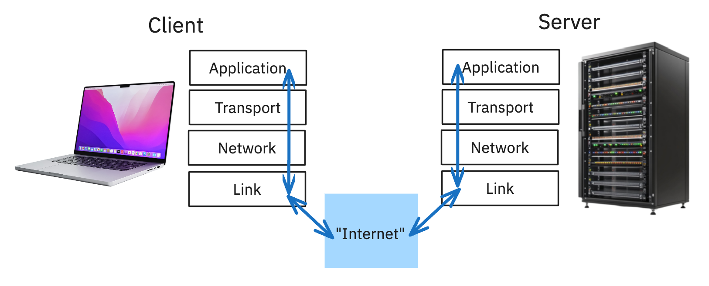

import { Image } from "astro:assets";
import userKernelSocket from "./user-kernel-socket.png";


## Introduction: The Challenge

Ever wondered what *really* happens when you click a download link? It seems like magic. You click, and a file appears. But behind that simple action lies a carefully orchestrated conversation between computers, a conversation refereed by their operating systems. For my first project in Georgia Tech's Graduate Introduction to Operating Systems (CS 6200), I had to build one side of that conversation: a multithreaded file server, from scratch, in C.

The goal was to implement a server capable of handling multiple file requests simultaneously. This wasn't just about writing code; it was about a head-first dive into the core concepts that make the modern internet possible: network sockets, system calls, concurrency, and protocol design.

Going in, I was comfortable with C's syntax but had never touched the Berkeley socket API. Networking was a black box I'd only ever interacted with through the convenient abstractions like Python's `requests` library. This project was my opportunity to pry open that box. This post documents that journey, not just what I built, but the fundamental *whys* behind the code.

## The Foundation: Client-Server & Network Models

At its heart, network communication is a conversation. The most common pattern for this conversation is the **client-server model**. It's a simple idea: a **client** (like your web browser) needs something, and a **server** (like the computer hosting `google.com`) has something to provide. The client initiates the conversation, and the server responds.



But for this conversation to work, both sides need to speak the same language and follow the same rules. The **TCP/IP model** provides this rulebook. It's a 4-layer stack, and for this project, we're mostly concerned with two:

1.  **Application Layer:** This is where our custom application logic lives. We define the *meaning* of the conversation. For web browsers, this is HTTP (`GET /index.html...`).
2.  **Transport Layer:** This layer is responsible for the reliability of the connection. We primarily use the **Transmission Control Protocol (TCP)**. For sending a file, TCP is the perfect choice. It's *connection-oriented* (the client and server maintain a connection for the duration of the transfer) and *reliable* (it guarantees that all the bytes you send will arrive at the destination, and in the correct order). The alternative, UDP, is faster but "fire-and-forget"—not ideal when you can't afford to lose a single byte of your file.

The Operating System handles the lower layers (Network and Link), managing the messy details of IP addresses and routing data across the physical network. Our application code, thankfully, doesn't have to worry about that. Instead, it talks to the Transport Layer through an interface provided by the OS: a socket.

### Sockets: The OS Gateway to the Network

A **socket** is one of the most powerful abstractions in modern computing. It's a special kind of file descriptor that represents a connection endpoint. Think of it like a phone jack in the wall. As an application developer, you don't need to know about the complex wiring inside the wall (the TCP/IP stack, the network card drivers); you just need to know how to plug your "phone" into the jack to start a conversation.

This abstraction is necessary because network hardware is a protected resource. Your user-level application can't just write bytes to the network card directly. That would be chaos. Instead, you have to ask the OS to do it for you. This is accomplished via **system calls**.

<div style="margin: 0 auto; max-width: 600px;">
    <Image src={userKernelSocket} alt="Sockets" />
</div>

When your program calls a function like `send()`, it's not an ordinary function call. It's a request to the OS kernel. The CPU switches from **User Mode** to **Kernel Mode**, a privileged state where it has full access to the hardware. The kernel takes your data, breaks it into packets, adds the necessary TCP/IP headers, and sends it to the network card. This user/kernel separation is a fundamental security and stability feature of all modern operating systems.

### The Socket API in Action (C)

The API for using sockets is direct and explicit. Here's a conceptual overview of the key API calls for a simple server and client.

**Server Lifecycle:**

```c
// 1. Create the socket
int server_fd = socket(AF_INET, SOCK_STREAM, 0);

// 2. Bind the socket to an address and port
struct sockaddr_in address;
// ... setup address struct ...
bind(server_fd, (struct sockaddr *)&address, sizeof(address));

// 3. Listen for incoming connections
listen(server_fd, 5); // 5 is the backlog size

// 4. Accept a new connection (this blocks until a client connects)
int client_fd = accept(server_fd, NULL, NULL);

// 5. Communicate with the client
char buffer[1024] = {0};
recv(client_fd, buffer, 1024, 0);
send(client_fd, "Hello from server", 16, 0);

// 6. Close the connection
close(client_fd);
```

**Client Lifecycle:**
```c
// 1. Create the socket
int client_fd = socket(AF_INET, SOCK_STREAM, 0);

// 2. Specify server address to connect to
struct sockaddr_in serv_addr;
// ... setup server address struct ...

// 3. Connect to the server
connect(client_fd, (struct sockaddr *)&serv_addr, sizeof(serv_addr));

// 4. Communicate
send(client_fd, "GETFILE my_document.txt", 24, 0);
recv(client_fd, buffer, 1024, 0);

// 5. Close the connection
close(client_fd);
```
The server's flow is more complex because it has a "listening" socket that acts as a factory, creating a *new* socket for each client connection it accepts.

## Designing Our `GETFILE` Protocol

With the ability to send and receive bytes, we needed to give those bytes meaning. We designed a simple, line-based ASCII protocol named `GETFILE`. Designing your own protocol, no matter how simple, is a fantastic exercise. It forces you to think about ambiguity and error handling.

Our specification was:
1.  **Client Request:** The client sends a single line of text terminated by a newline (`\n`): `GET <filename>\n`.
2.  **Server Success Response:** If the file exists and is readable, the server responds with: `OK <file_size_in_bytes>\n<raw_file_data>`. The client knows to read exactly `file_size_in_bytes` from the socket after the newline.
3.  **Server Error Response:** If the file doesn't exist or can't be read, the server sends a single line: `ERROR <error_code>\n`. We defined codes like `1` for FILE_NOT_FOUND and `2` for PERMISSION_DENIED.

This simple design is surprisingly effective, but it also reveals why real-world protocols like HTTP have complex headers. What if the filename contains a space? What about non-ASCII characters? Our simple protocol doesn't handle this, but it was robust enough for the task at hand.

## Scaling Up: The Move to Multithreading

Our initial server worked, but it had a huge flaw: it was single-threaded. It could only handle one client at a time. If one client requested a very large file, every other client had to wait for that transfer to complete. This does not scale.

The solution is **multithreading**, and a common way to apply it here is the **Boss/Worker pattern**.

*   **The Boss Thread (Main Thread):** This thread has one job and one job only: accept new client connections. It runs the `listen()` and `accept()` calls. When `accept()` returns a new client socket descriptor, the Boss doesn't handle the client itself. Instead, it places the descriptor into a shared work queue.
*   **Worker Threads:** We create a pool of worker threads when the server starts. These threads all wait for work to appear in the queue. When a descriptor is added, one worker wakes up, takes the descriptor from the queue, and then handles the entire `GETFILE` transaction for that single client. Once it's done, it closes the client socket and goes back to waiting for more work.

This model isolates concerns. The Boss handles new connections; the Workers handle the actual protocol logic. This allows the server to be accepting a new connection while other workers are busy sending files.

### The Danger Zone: Race Conditions and Mutexes

This is where the real complexity of concurrent programming appears. The "work queue" is shared memory, accessed by the Boss (writing) and all Workers (reading). What happens if the Boss tries to add to the queue at the exact same moment a Worker is trying to remove from it? This is a **race condition**, and it can corrupt the state of your queue, leading to crashes or bizarre bugs.

The section of code that accesses this shared queue is called a **critical section**. We must ensure that only one thread can be inside this critical section at a time. This principle is called **mutual exclusion**.

In C, we enforce this with a `pthread_mutex_t` (a **mutex**, for **mut**ual **ex**clusion). A mutex is a lock. Before entering the critical section, a thread must acquire the lock. If another thread already holds the lock, it will be forced to wait. Once the thread is finished with the shared data, it releases the lock, allowing another waiting thread to proceed.

```c
// Simplified example
pthread_mutex_t queue_lock;
// ...
// In Boss thread:
pthread_mutex_lock(&queue_lock);
// Add new client_fd to queue
pthread_mutex_unlock(&queue_lock);

// In Worker thread:
pthread_mutex_lock(&queue_lock);
// Get client_fd from queue
pthread_mutex_unlock(&queue_lock);
// Handle client...
```
Getting the locking right is one of the hardest parts of concurrent programming, but it's essential for a correct and stable multithreaded application.

## Building and Testing

A C project of this complexity demands proper tooling for building and testing.

*   **Environment:** The project had specific Linux dependencies, so I used **Vagrant** to create a consistent, reproducible virtual machine, mirroring the official testing environment. This saved me from countless "works on my machine" headaches.
*   **Build System:** You can't just run `gcc` over and over. A `Makefile` is essential. It automates the process of compiling, linking, and cleaning up object files. It's also the perfect place to store compiler flags like `-Wall` (turn on all warnings), `-g` (include debugging symbols), and `-pthread` (link the pthreads library).
*   **Automated Testing:** How do you know your server *really* works? You write tests. And the best way to test a server is to write a client in a completely different language. It forces you to adhere strictly to your protocol specification. I used Python and `pytest`, whose `socket` library is a thin wrapper around the same C APIs.

Here's a small `pytest` example:
```python
import socket

# Assumes the C server is running on localhost:8888
SERVER_ADDR = ("localhost", 8888)

def test_get_file_success():
    """Tests a successful file download."""
    with socket.socket(socket.AF_INET, socket.SOCK_STREAM) as s:
        s.connect(SERVER_ADDR)
        s.sendall(b"GET existent_file.txt\n")

        # Read the 'OK <size>\n' header
        header = s.recv(1024).split(b'\n')[0]
        parts = header.split(b' ')
        assert parts[0] == b"OK"
        size = int(parts[1])

        # Read the file content
        data = s.recv(size)
        assert len(data) == size
        # Could also assert file content matches a local copy

def test_get_file_not_found():
    """Tests the server's response for a non-existent file."""
    with socket.socket(socket.AF_INET, socket.SOCK_STREAM) as s:
        s.connect(SERVER_ADDR)
        s.sendall(b"GET non_existent_file.txt\n")
        response = s.recv(1024)
        assert response.strip() == b"ERROR 1"
```

## Conclusion: From Class Project to Real-World Insight

This project was one of the most rewarding I've ever worked on. It demystified the network, revealing the layered, cooperative system that underpins so much of modern technology.

My key takeaways were:
*   **The OS is your best friend:** It provides powerful, time-tested abstractions like sockets and threads that let you stand on the shoulders of giants.
*   **Concurrency is tricky:** The power of multithreading comes with the price of complexity. Careful design and synchronization using tools like mutexes are not optional; they are requirements for correctness.
*   **Protocols are everything:** The foundation of any network service is a clear, unambiguous protocol.
*   **Test from the outside:** A robust test suite, especially one that mimics a real client, is the only way to be confident in your system's reliability.

The patterns used here—thread pools, work queues, custom protocols—are the building blocks for the massive, distributed systems we use every day. While a web server like Nginx uses far more advanced techniques (like event-driven I/O with `epoll`), the fundamental goal is the same: handle as many concurrent clients as possible, as efficiently as possible. This project provided a tangible, low-level look at how that goal is achieved. It was a fantastic journey from the magic of a click to the logic of a `send()`.
