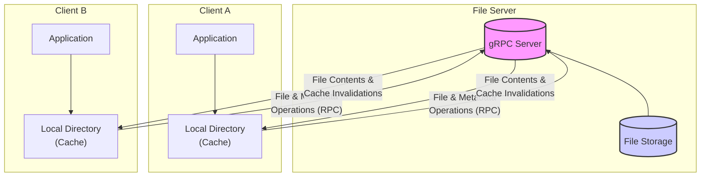
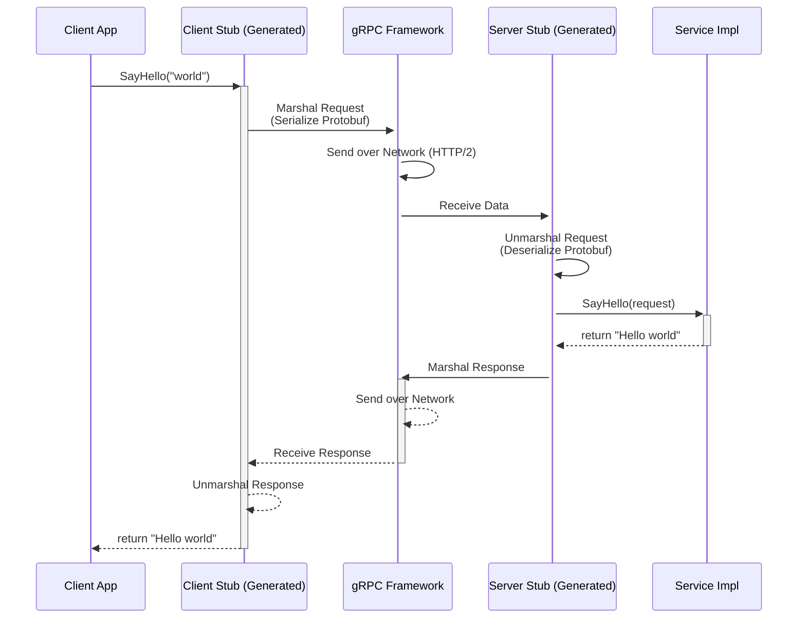
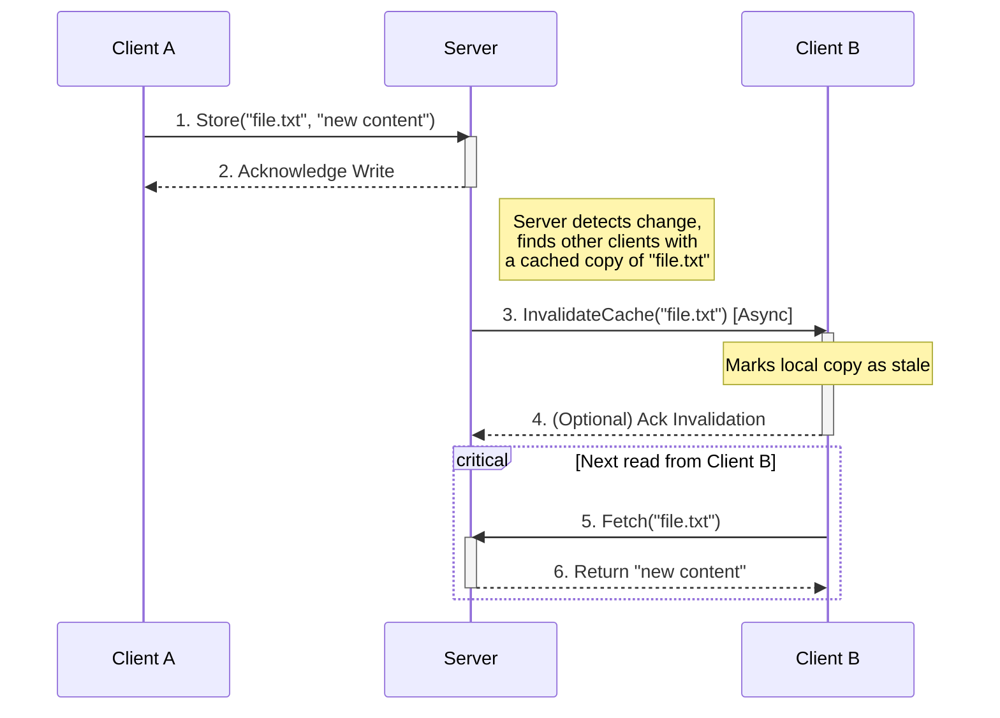

import { Image } from "astro:assets";
import BookCard from "../../../../components/BookCard.astro";
import Figure from "../../../../components/Figure.astro";

import osTepImg from "../../../books/os-tep.jpg";
import linuxInterfaceImg from "../../../books/linux-interface.png";
import cLangImg from "../../../books/c-lang.jpg";
import cPlusPlusConcurrencyImg from "../../../books/c++concurrency-in-action.jpg";
import cPlusPlusTourImg from "../../../books/a-tour-of-c++.jpg";
import ddiaImg from "../../../books/ddia.jpg";

## Introduction: The "Magic" of Google Drive

The seamless sync of Google Drive feels like magic. I can edit a document on my laptop, and it instantly appears on my phone. This seamless synchronization feels effortless, but it's the result of a complex, carefully engineered **Distributed File System (DFS)**.

A DFS is the backbone of modern cloud storage and collaboration. It allows multiple, geographically dispersed clients to access and modify a shared set of files as if they were stored on a single, local machine. For my final project in Georgia Tech's operating systems course, I was tasked with building one from the ground up in C++.

In the first project I built a simple file system with a single client and 
server. In the second project I extended it to add a proxy and cache server. 
This project is the final step in the journey, building a distributed file 
system with multiple clients and servers. This project was a fantastic 
opportunity to tackle the challenges of distributed computing. This post 
explores the key lessons from that journey, focusing on the three pillars of 
any DFS: remote communication, data consistency, and synchronization.

## The Anatomy of a Distributed File System

{/* <Figure
  caption="A simplified Distributed File System (DFS) architecture. Clients maintain local caches of files and use Remote Procedure Calls (RPCs) to communicate with a central server that manages the authoritative file storage."
> */}

{/* </Figure> */}

A DFS hides the complexity of the network behind the standard file system interface that applications already know how to use (`open`, `read`, `write`, `close`). But under the hood, it must make fundamental design decisions about how data is stored, accessed, and kept consistent.

### Architectural Models: Replication vs. Partitioning

{/* TODO: Add a figure here illustrating the difference between replication and partitioning. */}

There are several ways to architect a DFS server infrastructure:
- **Replication:** The simplest model is to have multiple servers, each holding a complete copy of every file. This provides high **fault tolerance** (if one server fails, others can take over) and **high availability** (requests can be balanced across any server).
- **Partitioning:** In this model, the file set is split up, with each server holding only a subset of the files. This is incredibly **scalable**—if you need to store more files, you just add more servers. However, if a server holding a partition fails, that data becomes unavailable.

In practice, many large-scale systems use a hybrid approach, partitioning the data into chunks and then replicating each chunk across multiple servers to get the benefits of both scalability and fault tolerance.

### The Caching Compromise

{/* TODO: Add a figure here illustrating the difference between the client interaction models. */}

At the heart of any DFS is a fundamental trade-off in how clients interact with remote files. The course notes outline two extremes:

- **The Upload/Download Model:** A client downloads the entire file, modifies it locally, and uploads the entire file back. This is fast for local edits but inefficient for small changes and gives the server no control over concurrent access.
- **True Remote Access:** Every single file operation (`read` a byte, `write` a byte) is sent over the network to the server. This gives the server complete control, making consistency easy, but it's painfully slow and doesn't scale.

Neither extreme is practical. The necessary compromise is **caching**. Clients cache parts of files locally to speed up access. This is the best of both worlds: it reduces network latency for many operations and lessens the load on the server. However, it introduces the central challenge of DFS design: if a client has a cached copy, how do we ensure it's kept up-to-date when someone else changes the file?

This is where the concepts of consistency models, remote procedure calls, and synchronization mechanisms—the core topics of this project—become critical.

## The Language of Distributed Systems: RPC and gRPC

In a distributed system, processes running on different machines need a way to talk to each other. You could build a custom protocol on top of raw sockets, as we did in the [first project](/ideas/2025/gios-pr1/), but this is complex and error-prone. A much more robust and scalable approach is to use a **Remote Procedure Call (RPC)** framework.

RPCs create a powerful abstraction: they allow a program to call a function or method on a remote machine as if it were a normal, local function call. The RPC framework handles all the messy details of networking, data serialization (converting data structures into a format for network transmission), and error handling, letting you focus on the application logic.

### How RPCs Work: Stubs, Marshalling, and IDLs

At its core, an RPC interaction is a client-server exchange designed to look like a simple function call. This illusion is created by a few key components:

1.  **The Client and Server Stubs:** When a client calls a remote function, it's actually calling a local function in a **client stub**. This stub's job is to take the arguments, package them up, and send them over the network to the server. On the server side, a **server stub** (or "skeleton") receives the package, unpacks the arguments, and calls the actual implementation of the function.
2.  **Marshalling and Unmarshalling:** The process of packaging the function arguments into a format suitable for network transmission (like a byte stream) is called **marshalling**. The reverse process on the server side—unpacking the byte stream back into arguments—is called **unmarshalling**. The same process happens in reverse for the function's return value.
3.  **Interface Definition Language (IDL):** The client and server need to agree on the set of available functions and the exact structure of their arguments and return values. This "service contract" is formally defined in a language-agnostic **Interface Definition Language (IDL)**. The IDL file is used by the RPC framework to automatically generate the client and server stubs.

For this project, I used **gRPC**, a modern, high-performance RPC framework developed by Google, paired with **Protocol Buffers (protobufs)** for defining the service and structuring the data.

### Defining the Service with Protocol Buffers

Before you can make a call, you have to define the "service contract"—the set of available functions and the structure of the data they exchange. With gRPC, you do this in a simple `.proto` file, which is a specific type of IDL. This language-agnostic definition is the single source of truth for the entire system.

As Martin Kleppmann explains in his analysis of serialization formats, the way data is encoded from the schema has huge implications for performance and flexibility. Unlike text-based formats like JSON, Protocol Buffers uses the schema to create a compact binary representation. Each field defined in the `.proto` file is assigned a unique tag number. When marshalling data, Protobuf encodes the record as a simple concatenation of its fields, where each field is prefixed with its tag number and type. This means the field names (`userName`, `favouriteNumber`, etc.) are not stored in the encoded data, saving a significant amount of space [[2]](https://martin.kleppmann.com/2012/12/05/schema-evolution-in-avro-protocol-buffers-thrift.html).

This tag-based approach is also what enables powerful **schema evolution**. If a parser encounters a tag it doesn't recognize (perhaps because it's from a newer version of the schema), it can use the type information embedded with the tag to determine how many bytes to skip, allowing it to parse the rest of the record. This allows different components of a large system to be updated independently without breaking compatibility [[2]](https://martin.kleppmann.com/2012/12/05/schema-evolution-in-avro-protocol-buffers-thrift.html).

For this project, the `.proto` file defined the core API of the Distributed File System. It specified:
- RPCs for essential file operations: `Fetch`, `Store`, and `Delete`.
- RPCs to `List` files with their metadata and `GetAttributes` for a specific file (such as size and modification times).
- The structure of request and response messages, defining what data is needed for each call (e.g., a filename) and what data is returned (e.g., file content and a timestamp).
- A long-lived, server-to-client streaming RPC for the server to proactively send cache invalidation notifications to clients.

In accordance with academic integrity policies, I have not included the exact `.proto` file from the project. However, to illustrate the syntax, here is a generic "Greeter" service, a common example used in gRPC documentation:

```protobuf
syntax = "proto3";

package helloworld;

// The greeting service definition.
service Greeter {
  // Sends a greeting
  rpc SayHello (HelloRequest) returns (HelloReply) {}
}

// The request message containing the user's name.
message HelloRequest {
  string name = 1;
}

// The response message containing the greetings
message HelloReply {
  string message = 1;
}
```
From a file like this, the `protoc` compiler can generate all the necessary client and server code in C++, Python, Go, or a dozen other languages.

### Making the Call in C++

With the service defined, making a remote call from the C++ client becomes remarkably clean. The generated code provides a "stub" object that has methods corresponding to each RPC defined in the `.proto` file.

In the DFS client, this stub was used to invoke the remote `Fetch`, `Store`, and `Delete` methods on the server. The client code was responsible for creating a request message, populating it with the necessary data (like the filename), invoking the stub method, and then processing the server's response or handling any network errors.

To avoid academic integrity issues, here is a generic example showing how a client would call the `SayHello` RPC from the `Greeter` service defined above:

```cpp
// Conceptual C++ code for a client making a gRPC call.
// Error handling and full setup omitted for brevity.
#include <grpcpp/grpcpp.h>
#include "helloworld.grpc.pb.h"

using grpc::Channel;
using grpc::ClientContext;
using grpc::Status;
using helloworld::Greeter;
using helloworld::HelloRequest;
using helloworld::HelloReply;

class GreeterClient {
public:
    GreeterClient(std::shared_ptr<Channel> channel)
        : stub_(Greeter::NewStub(channel)) {}

    // Assembles the client's payload, sends it and presents the response back
    // from the server.
    std::string SayHello(const std::string& user) {
        HelloRequest request;
        request.set_name(user);

        HelloReply reply;
        ClientContext context;

        // The actual RPC call.
        Status status = stub_->SayHello(&context, request, &reply);

        if (status.ok()) {
            return reply.message();
        } else {
            std::cout << status.error_code() << ": " << status.error_message() << std::endl;
            return "RPC failed";
        }
    }

private:
    std::unique_ptr<Greeter::Stub> stub_;
};

int main() {
    std::string server_address("localhost:50051");
    GreeterClient greeter(grpc::CreateChannel(
        server_address, grpc::InsecureChannelCredentials()));
    std::string user("world");
    std::string reply = greeter.SayHello(user);
    std::cout << "Greeter received: " << reply << std::endl;

    return 0;
}
```
All the complexity of serialization, network sockets, and HTTP/2 framing is hidden behind that single `stub_->SayHello()` call. This is the power of a modern RPC framework.

{/* <Figure
  caption="The Remote Procedure Call (RPC) flow. The client call is marshalled, sent over the network, and unmarshalled by the server stub, which then invokes the actual service implementation. The process is reversed for the response."
> */}

{/* </Figure> */}

## The Consistency Challenge: From Strong to Eventual

One of the hardest problems in any distributed system is **consistency**. If Client A and Client B both have a copy of `document.txt`, and Client A edits it, how and when does Client B see that change? There's a spectrum of possible guarantees, or **consistency models**, each with different trade-offs between correctness and performance.

*   **Strong Consistency:** This is the most intuitive model. Any read will always return the result of the most recently completed write. It's as if there's only one single copy of the data in the entire system. This is the easiest to reason about, but it's often the slowest, as it may require complex locking or coordination across the network for every single operation.

*   **Sequential Consistency:** A slightly relaxed model where all operations appear to have executed in *some* total global order, and that order is consistent with the order of operations on each individual client. This is still a very strong guarantee.

*   **Eventual Consistency:** This is the weakest model. It guarantees that if no new updates are made, all replicas will *eventually* converge to the same value. It doesn't say *when* this will happen. This model offers the best performance and availability, as clients can continue to read and write from local replicas without waiting for network communication. Systems like DNS and many NoSQL databases use this model.

This project implemented a **weak consistency model** inspired by the **Andrew File System (AFS)**, which strikes a pragmatic balance. In this model:
- Clients aggressively **cache** copies of files locally for fast access.
- When a client wants to *modify* a file, it must acquire a **write lock** from the server. This ensures only one client can write to a file at any given time, preventing "lost update" anomalies.
- The client determines if a file has changed by comparing its local version's CRC32 checksum and last-modified timestamp against the server's version.
- When a client closes a modified file, it uploads the new version to the server. The server then sends out **cache invalidation** callbacks to all other clients that have a copy of that file, telling them their version is now stale.

This "write-on-close" strategy provides good performance for reads, as they are served from the local cache, while still providing reasonable guarantees about seeing up-to-date data. This "write-on-close" strategy provided the ideal trade-off for this project: it made reads snappy by serving them from the local cache, while still providing strong enough guarantees to prevent lost updates and keep data reasonably fresh across all clients.

{/* <Figure
    caption="Weak consistency with cache invalidation. A write from Client A updates the server, which then asynchronously tells Client B that its cached copy is stale. Client B will fetch the new version on its next read."
> */}

{/* </Figure> */}

## Synchronization in Action: `inotify` and Server Callbacks

To make the system feel responsive, changes need to be propagated automatically. Waiting for a user to manually sync is not an option. This project used two key mechanisms for this.

1.  **Client-Side File Watcher:** The client used Linux's `inotify` API to monitor its local file directory. `inotify` is an event-driven mechanism that allows an application to be notified by the kernel whenever a file is created, modified, or deleted in a specific directory. This is far more efficient than constantly polling the directory to check for changes. When an event was detected, the client would automatically trigger the appropriate RPC to the server (e.g., `Store` for a modification).

2.  **Asynchronous Server Callbacks:** As seen in the `.proto` definition, the server has a `ListenForInvalidations` RPC. This is a long-lived, server-to-client streaming RPC. The client calls this once when it connects, and the server keeps the connection open. When the server needs to invalidate a file, it simply sends an `Invalidation` message down this established stream. This is far more efficient and scalable than having the server initiate a new connection to every client for every update.

This architecture also presented a significant client-side challenge: the `inotify` watcher and the asynchronous gRPC callback listener run on separate threads. This required careful synchronization to ensure that local file events and remote server notifications were handled correctly without race conditions.

## Broader Implications and Applications

The concepts explored in this project have real-world applications in:
- **Cloud Storage Services** (e.g., Google Drive, Dropbox) where multiple users edit shared files.
- **Distributed Databases** that replicate data across nodes while maintaining consistency.
- **Big Data Processing** frameworks that distribute large files across multiple servers for analysis.

## Final Thoughts
This project highlighted the importance of designing distributed systems that balance **performance, consistency, and reliability**. Building a distributed file system from scratch was a journey through the fundamental trade-offs that engineers face when building large-scale systems. Whether working on cloud storage, real-time collaboration tools, or distributed databases, the principles of **remote communication, data consistency, and synchronization** are the essential pillars for building robust and scalable solutions.

## Additional resources

These books and guides were extremely helpful for understanding the concepts and APIs for this project.

<BookCard
  title="The C Programming Language"
  author="Brian W. Kernighan and Dennis M. Ritchie"
  img={cLangImg}
  url="https://www.google.com/books/edition/The_C_Programming_Language/OpJ_0zpF7jIC"
>
    <p>
        While the project was in C++, a strong foundation in C is essential. This book remains the definitive guide.
    </p>
</BookCard>

<BookCard
  title="The Linux Programming Interface"
  author="Michael Kerrisk"
  img={linuxInterfaceImg}
  url="https://man7.org/tlpi/"
>
    <p>
        An encyclopedic guide to the Linux and UNIX system programming interface. The chapters on file systems and `inotify` were particularly relevant.
    </p>
</BookCard>

<BookCard
  title="Operating Systems: Three Easy Pieces"
  author="Remzi H. Arpaci-Dusseau and Andrea C. Arpaci-Dusseau"
  img={osTepImg}
  url="https://pages.cs.wisc.edu/~remzi/OSTEP/"
>
  <p>
    The main book I used to supplement the lectures. The chapters on distributed systems provided excellent conceptual background.
  </p>
</BookCard>

<BookCard
  title="C++ Concurrency in Action"
  author="Anthony Williams"
  img={cPlusPlusConcurrencyImg}
  url="https://www.manning.com/books/c-plus-plus-concurrency-in-action-second-edition"
>
  <p>
    A great book for understanding the concurrency features of C++.
  </p>
</BookCard>

<BookCard
  title="A Tour of C++, 3rd Edition"
  author="Bjarne Stroustrup"
  img={cPlusPlusTourImg}
  url="https://www.stroustrup.com/tour3.html"
>
  <p>
    A great book for understanding the features of C++.
  </p>
</BookCard>

<BookCard
  title="Designing Data-Intensive Applications"
  author="Martin Kleppmann"
  img={ddiaImg}
  url="https://www.amazon.com/Designing-Data-Intensive-Applications-Reliable-Maintainable/dp/1449373321"
>
  <p>
    A great book for understanding the principles of distributed systems.
  </p>
</BookCard>

- [gRPC C++ Quickstart](https://grpc.io/docs/languages/cpp/quickstart/)

> [!info] A Note on Code Availability
> In accordance with Georgia Tech's academic integrity policy and the license for course materials, the source code for this project is kept in a private repository. I believe passionately in sharing knowledge, but I also firmly respect the university's policies. This document follows [Dean Joyner's advice on sharing projects](https://www.reddit.com/r/OMSCS/comments/zwdwns/comment/j1udv6w/) with a focus not on any particular solution and instead on an abstract overview of the problem and the underlying concepts I learned.
>
> I would be delighted to discuss the implementation details, architecture, or specific code sections in an interview. Please feel free to reach out to request private access to the repository.
