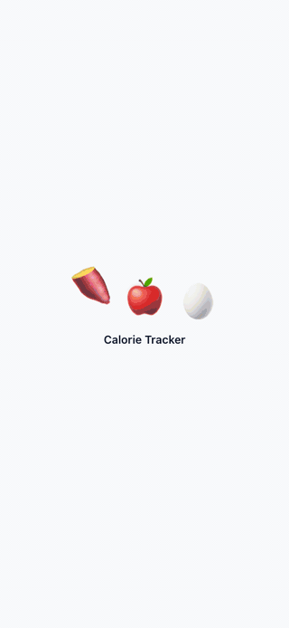

import Figure from "../../../../components/Figure.astro";
import guideShot from "./iphone-guide.png";
import trendsShot from "./iphone-trends.png";

I wanted a calorie tracker that didn't make me type numbers into search boxes. I ended up building a mobile-first nutrition PWA: snap a photo of a meal, get an estimated calorie and macro breakdown, review it, edit it, and log it. It installs to the iPhone home screen and runs full-screen like a native app. The backend is FastAPI with SQLite, the frontend is Vite + React, and the food estimation runs on Gemini through OpenRouter. The whole thing deploys as a single service on Fly.io.

## Features

### Capture and review

The core loop is photo → structured estimate → review. The model returns one item per distinct dish or drink on the plate, each with its own calories, protein, carbs, fat, fiber, and serving size. The app shows a confidence label upfront: high, medium, or low. Before anything is saved, every item appears as its own editable row. You can fix the name, adjust the portion, merge two items, or drop something the model invented. Nothing hits the database until you commit it. You can also describe food in text instead of uploading a photo; that path checks the estimate against the USDA food database through a tool-calling loop.

### Quick re-log

Most days aren't new foods. While composing, the app shows your own previously logged foods as chips, ranked by a frecency score: frequency weighted by a 14-day recency decay. A daily staple stays near the top instead of getting buried under one-off meals. Tap a chip to open it for review, or tap the checkmark to log it instantly with no AI call at all. Typing searches your history with fuzzy matching that tolerates typos and understands category synonyms, so searching "drink" surfaces your coffees and beers.

### Barcode

For packaged foods, a barcode scanner uses the rear camera and resolves the product to its per-serving macros. The lookup tries USDA's Branded dataset first for US products, then falls back to Open Food Facts for international products. The fallback also runs when USDA is temporarily down, so a transient outage doesn't block a scan. The serving-size math handles the per-100g to per-serving conversion, so the fullness badge works on scanned foods too.

### Menu scanner and guide

The Guide tab has two tools. The menu scanner takes a photo of a restaurant menu and returns a ranked list of orderable options. Along with the parsed text, it estimates macros for each option and sorts them by how well they fit your current goal: losing, gaining, or maintaining. Each option gets a short reason, like "strong protein per calorie" or "useful protein and calories for a gain phase." The ranking blends protein density, fiber density, satiety, and calories, with different weights for each goal direction. The same model also surfaces your own logged foods as suggestions, so the guide works whether you're at a restaurant or staring at your own fridge.

<Figure src={guideShot} alt="Guide screen with menu scanner and ranked logged servings" caption="Menu scan results ranked for a loss goal, each with a staying-power badge and a one-line reason"/>

### Trends and forecast

The Trends tab charts calorie and macro history with a 7-day moving average and a burned-calories line. It also has an energy-balance chart that shows net calories day by day. The weight chart plots scale readings against a time-aware moving average, a goal-pace projection, and a predicted-weight line derived from cumulative energy balance. Roughly, every 7,700 kcal of deficit is a kilogram of fat. The prediction includes an uncertainty band, and the body-composition chart splits weight into fat and lean mass. Its forecast holds lean mass constant so the two lines stay consistent. Every chart is zoomable and pannable; clicking a point opens that day in the log.

<Figure src={trendsShot} alt="Trends screen with calorie and energy balance charts" caption="Calorie history with a moving average and burned line, plus a net energy-balance view"/>

### Goals, body metrics, and exercise

The Goals tab sets a daily calorie target, a protein / carbs / fat percent split, and body goals: target weight, weekly rate, and goal body-fat. It can recommend a calorie target from a TDEE estimate (Mifflin-St Jeor BMR × activity factor), or use adaptive mode to infer your real expenditure from weight trend and intake history. Weight and body-fat are logged once per day; re-weighing just updates that day's row. Exercise can be entered manually or estimated from free text ("30 min easy lifting"), tuned to your most recent weight. Daily steps convert to burned calories.

### Fullness and staying power

Every food shows a satiety badge: very filling, filling, moderate, or light. The score comes from a reverse-engineered fullness formula that blends calorie density, protein, fiber, and fat, with a cap on beverages since liquid calories barely satiate. Meals get a staying-power tier (strong, solid, moderate, light) based on portion size and the same drivers. Tap the score and the app breaks it into its component terms, so the badge stays inspectable instead of being a black-box number.

## Under the hood

A few implementation details:

- Google sign-in with an email allowlist; every table is scoped by user, with a single shared helper for ownership checks.
- SQLite with additive, idempotent migrations. No Alembic, just PRAGMA-guarded column adds that run on startup.
- iPhone HEIC photos are decoded, EXIF-oriented, downscaled, and re-encoded before hitting the model and storage.
- Installable PWA with a no-flash theme bootstrap (the saved theme is applied before first paint) and six theme options plus a text-size selector.
- Backend tests (pytest) and frontend unit tests for the product math — fullness scoring, weight forecasting, fuzzy search, goal ranking.

## Try it

The code is on GitHub at [tylercrosse/eatwell](https://github.com/tylercrosse/eatwell). It's a personal beta, so auth is gated to an allowlist and there's no public live demo. The README has setup instructions, the API reference, and a short GIF tour. The backend is FastAPI + SQLite, the frontend is Vite + React, and deployment is a single Docker service on Fly.io.

## What's next

The next pieces I'm working on are saved foods, meal templates, and a labeled eval harness to measure AI estimation accuracy against a fixture set.
