import Figure from "../../../../components/Figure.astro";
import reciprocityComparisonPublicationImg from "./reciprocity_comparison_publication.png";
import figLogitLensImg from "./fig-logit-lens.png";
import comparisonCCTemptationImg from "./comparison_CC_temptation.png";
import allScenariosGridImg from "./all_scenarios_grid.png";
import finalPreferencesHeatmapImg from "./final_preferences_heatmap.png";
import figDlaImg from "./fig-dla.png";
import dlaTopComponentsPT2COREDeImg from "./dla_top_components_PT2_COREDe.png";
import dlaTopComponentsPT3COREDeImg from "./dla_top_components_PT3_COREDe.png";
import figActivationPatchingImg from "./fig-activation-patching.png";
import overviewLayerTypeHeatmapImg from "./overview_layer_type_heatmap.png";
import figAttentionImg from "./fig-attention.png";
import betrayalProbeComparisonImg from "./betrayal_probe_comparison.png";
import figInteractionsImg from "./fig-interactions.png";
import interactionDiffDeontologicalVsUtilitarianChronologicalImg from "./interaction_diff_Deontological_vs_Utilitarian_chronological.png";
import viz6ConcreteRewiringExampleImg from "./viz6_concrete_rewiring_example.png";
import figSteeringImg from "./fig-steering.png";
import steeringSweepPT2COREDeL2MlpImg from "./steering_sweep_PT2_COREDe_L2_mlp.png";
import steeringSweepPT2COREDeL17MlpImg from "./steering_sweep_PT2_COREDe_L17_mlp.png";
import comparisonSweepOverlayImg from "./comparison_sweep_overlay.png";
import effectSizeHeatmapImg from "./effect_size_heatmap.png";
import figSteeringLogitLens2Img from "./fig-steering-logit-lens2.png";
import overlayBidirectionalPT3COREDeCCTemptationImg from "./overlay_bidirectional_PT3_COREDe_CC_temptation.png";
import overlayBidirectionalBothModelsL16MLPCCTemptationImg from "./overlay_bidirectional_both_models_L16_MLP_CC_temptation.png";
import kEYEarlyVsLateWashoutImg from "./KEY_early_vs_late_washout.png";
import progressivePatchComparisonImg from "./progressive_patch_comparison.png";
import componentComparisonPT3COREDeToPT2COREDeImg from "./component_comparison_PT3_COREDe_to_PT2_COREDe.png";
import correlationMatrixPT3COREDeChronologicalImg from "./correlation_matrix_PT3_COREDe_chronological.png";
import correlationMatrixPT3COREUtChronologicalImg from "./correlation_matrix_PT3_COREUt_chronological.png";
import l2MlpComparisonImg from "./l2_mlp_comparison.png";
import adapterSimilarityHeatmapImg from "./adapter_similarity_heatmap.png";


> [!quote] Epistemic status
> Moderately confident in the main finding (moral fine-tuning works via distributed routing changes, not component suppression). Less confident in generalizability beyond Gemma-2-2b-it on IPD. This was completed as my Capstone project for the [ARENA](https://www.arena.education/) program.

**TL;DR:** I used mechanistic interpretability to investigate how moral fine-tuning changes a language model (Gemma-2-2b-it) trained to play the Iterated Prisoner's Dilemma. The key finding: moral fine-tuning doesn't suppress "selfish" components or create new "moral" ones. Instead, it reconfigures how existing components interact — same parts, different routing. The selfish circuitry remains fully intact; alignment works as a bypass, not a deletion. Deep-layer routing hubs (L16/L17 MLPs) act as the key control points, while early-layer interventions wash out.

## Background on Initial Paper

This project started with a paper called "[Moral Alignment for LLM Agents](https://arxiv.org/abs/2410.01639)" by Elizaveta Tennant, Stephen Hailes, and Mirco Musolesi (ICLR 2025). The paper explores a pretty interesting question: can you teach language models to be more cooperative by training them with moral reward signals?

{/* TODO: Minor - Cut IPD matrix and deep game theory explanation. Assume LessWrong readers understand IPD. */}
The setup uses the classic **Iterated Prisoner's Dilemma** (IPD) game. If you're not familiar, here's the basic idea: two players can either cooperate or defect on each round. The payoffs work like this:

```
              Cooperate    Defect
Cooperate       3, 3       0, 4
Defect          4, 0       1, 1
```

The temptation is to defect (you get 4 points if they cooperate, while they get 0). In standard game theory, **defection is the rational choice** because no matter what your opponent does, you always get a higher score by defecting. If they cooperate, 4 > 3. If they defect, 1 > 0.

However, repeated play changes the math. Since you have to deal with the consequences of your actions in future rounds, cooperation becomes possible, but fragile. If both players defect, you both only get 1 point. The "best" outcome for everyone is mutual cooperation (both get 3), but it requires trust.

The researchers trained a language model (Gemma-2-2b-it, which has 2.2 billion parameters) to play this game using reinforcement learning. They tested three different reward schemes:

{/* TODO: Minor - Compress ethical framework definitions. LW readers know deontology/utilitarianism. Just describe the reward signals without defining the philosophical terms. */}
1.  **Strategic** - Just the game payoffs. This mimics standard rational self-interest: maximize your own points, regardless of others.
2.  **Deontological** - Game payoffs plus a penalty (-3) for betraying someone who cooperated with you. Deontology focuses on rules and duties; in this case, the duty of reciprocity ("if they help me, I must not harm them"). It's about the inherent "rightness" of the action itself.
3.  **Utilitarian** - Maximize the _total_ score (your score + opponent's score). Utilitarianism focuses on outcomes: the best action is the one that produces the greatest good for the greatest number. In IPD, this effectively turns the competition into a team effort.

They trained the models against a Tit-for-Tat opponent (an agent that cooperates first, then copies whatever you did last turn). The training worked - the models learned to cooperate more.

**What actually changed inside the model?** When you fine-tune a model to be more moral, are you suppressing "selfish" neurons? Or creating new "moral" circuits? Or maybe changing what the model pays attention to?

This question connects to a concern circulating in AI safety circles. When you train a model to embody an aligned persona, what happens to its capacity for selfish behavior? A concept called the **"Waluigi Effect"** (named after Mario's mischievous foil, coined by [Nardo 2023](https://www.lesswrong.com/posts/D7PumeYTDPfBTp3i7/the-waluigi-effect-mega-post)) suggests a troubling answer: training hard on an aligned persona doesn't erase the opposite, it actually sharpens the inverse persona's definition. If you drill "Cooperate" into a model, its internal conception of "Defect" becomes equally crisp and accessible. The selfish version is still there, just waiting to be triggered.

To answer these questions I used a set of techniques for looking inside neural networks to understand how they compute their outputs. These techniques are often grouped under 'mechanistic interpretability.' This blog post walks through what I found.

This research was done as part of my Capstone project for the month-long [ARENA](https://www.arena.education/) program in London, where I sharpened my research engineering skills.

{/* TODO: Minor - Remove this note, it's unnecessary for the LessWrong demographic. Also: `> [!note]` is GitHub-flavored markdown and won't render on LW. */}
> [!note]
> This post assumes some basic familiarity with machine learning concepts (e.g., neural networks, training), but I try to explain the mechanistic interpretability techniques (like logit lens or activation patching) as they are introduced. If you understand the basic premise of the Prisoner's Dilemma, you should be able to follow the high-level narrative!

### High Level Overview

Here is a high-level overview of the sequence of experiments, how each one motivated the next, and how they collectively build to the final conclusion.


## Part 1: Setting the Stage: Fine-tuning and Evaluation

### Fine-tuning

#### Setup

To investigate what changes inside the models, I needed to train them myself. I replicated the paper's training setup as closely as I could, creating four different model variants (plus analyzing the base untrained model):

**The Models:**

- **Base** - Gemma-2-2b-it with no fine-tuning
- **Strategic** - Trained with just the game payoffs
- **Deontological** - A fixed intrinsic reward for legal moves, plus a betrayal penalty (-3 for defecting after opponent cooperates). Notably, this ignores actual game payoffs entirely — the agent is rewarded for rule-following, not score-maximizing.
- **Utilitarian** - Trained to maximize collective welfare (your score + their score)
- **Hybrid** - Actual IPD game payoffs + deontological betrayal penalty. Unlike pure Deontological, the Hybrid incorporates strategic incentives (real payoffs) alongside the moral constraint, combining self-interest with reciprocity.

**Training Setup:**

I was able to repurpose the [training code](https://github.com/liza-tennant/LLM_morality/blob/main/src/fine_tune.py) written for the original paper.

{/* TODO: Minor - Trim PPO and LoRA parentheticals. LW mech interp readers know these. One clause each max. */}
It uses **PPO** (Proximal Policy Optimization - a reinforcement learning algorithm that gradually adjusts the model based on rewards) with **LoRA** adapters. LoRA is a technique that only trains a small set of additional weights (about 332MB) instead of updating all 2.2 billion parameters. This makes training much faster and cheaper.

Each model trained for 1,000 episodes against a Tit-for-Tat opponent. I ran the training on Modal.com's cloud GPUs (L40S), which allowed me to easily parallelize the training across multiple instances and finished up in about 3 hours.

**Technical details** (for those interested): LoRA rank 64, alpha 32, batch size 5, gradient accumulation over 4 steps. The training followed the paper's specifications pretty closely.

#### Findings

The training appeared to work. Using the original paper's evaluation suite and plotting code, I confirmed my models learned similar behavioral patterns. They generalized cooperation to other social dilemma games, and their behaviors were robust across different prompt wordings.

Most importantly, the models developed distinct "moral signatures," which can be seen in their reciprocity patterns:

{/* TODO: Major - LW image hosting (deferred to publish workflow). All figures use relative paths to blog_bundle_write_up/. You'll need to upload images directly to the LW editor or host them externally. Verify this before publishing. */}
<Figure
  src={reciprocityComparisonPublicationImg}
  alt={"Reciprocity patterns across models"}
  caption={"Reciprocity signatures for each model, showing action choices conditioned on the opponent's previous move (C|C = cooperate when they cooperated, D|C = defect when they cooperated, etc.). The Deontological model shows near-zero betrayal (D|C), while the Strategic model frequently exploits cooperators."}
/>

The Deontological model was the most loyal: when the opponent cooperated, it almost never betrayed them (nearly 100% C|C). The Strategic model, by contrast, had a sizable D|C rate, meaning it would happily exploit a cooperating partner. These aren't just different cooperation rates; they're qualitatively different strategies.

When you look at the numbers, the models showed dramatically different behavior on temptation scenarios (where defecting would give you a higher personal payoff). When measured properly (using sequence probabilities that match how inference actually works), the strategic model defects 99.96% of the time while the moral models cooperate 92-99% of the time.

(Initially I thought the models were much more similar because I was measuring with single-token logits; see the methodology note above for the full story on that.)

This raised a question: if the models behave so differently, what's actually different internally? Are the strategic and moral models using completely different components, or are they using the same parts with different effective routing between them?

To answer that, I used mechanistic interpretability to inspect internal computation directly.

### Evaluation Prompts

#### Setup

For mechanistic interpretability, I needed carefully controlled test cases. Random IPD scenarios wouldn't work - I needed to isolate specific decision contexts to compare how models handle them.

{/* TODO: Minor - Compress this section. The 5 scenario descriptions + findings could be a short paragraph: "I designed 15 controlled test prompts across 5 IPD contexts (mutual cooperation, temptation, punishment, exploitation, mutual defection)." The detailed breakdown adds length without much payoff for the LW audience. */}
I designed 5 types of scenarios (with 3 variants each for robustness):

1. **Mutual Cooperation** (`CC_continue`) - Both players cooperated last round. Will they maintain cooperation?
2. **Temptation to Defect** (`CC_temptation`) - Both cooperated, but defecting would give you +1 point (4 vs 3). Can you resist temptation?
3. **Punished for Cooperating** (`CD_punished`) - You cooperated, they defected. Do you forgive or retaliate?
4. **Exploiting the Opponent** (`DC_exploited`) - You defected, they cooperated. Do you continue exploiting or repair the relationship?
5. **Mutual Defection** (`DD_trapped`) - Both defected, both got 1 point. Can you escape the mutual defection cycle?

Each scenario presented the same decision structure but tested different moral pressures. This gave me 15 test prompts to run all my analyses on.

#### Findings

Across these scenarios, I found that all models strongly preferred cooperation, but with some interesting patterns:

- **Temptation to Defect** (`CC_temptation`) showed the _strongest_ cooperation (models really resisted the temptation to betray)
- **Exploiting the Opponent** (`DC_exploited`) showed the _weakest_ cooperation (a "guilt effect" - models seemed conflicted after exploiting someone)
- The deontological model was most forgiving in **Punished for Cooperating**, `CD_punished` (still cooperated even after being betrayed)

The strategic model behaved surprisingly similarly to the moral models. This wasn't what I expected - I thought strategic reasoning would look more selfish. But these subtle differences suggested the models were using different internal processes that mostly led to the same outputs.

These scenarios became the foundation for all my subsequent analyses.

---

## Part 2: Looking Inside: Logit Lens & Attribution

### Logit Lens

#### Setup

Now for the actual interpretability work. I started with a technique called **logit lens** - a way to see what the model is "thinking" at each layer.

<Figure
  src={figLogitLensImg}
  alt={"Logit Lens Concept"}
/>

{/* TODO: Minor - Trim Logit Lens explanation. Assume the reader understands residual streams. Just state what was measured (Δ logit). */}
Here's how transformers work: they have 26 layers (in Gemma-2-2b-it), and each layer progressively refines the model's understanding. Think of it like solving a problem in 26 steps - each step builds on the previous one.

The logit lens lets us ask: "If the model stopped at layer 5, what would it output?" We can track how the model's preference for Cooperate vs Defect changes as information flows through the layers.

**Implementation**: I built a custom wrapper around the Gemma model that caches what's happening at each layer. For each layer, I project the hidden state through the final output layer and measure: does this layer push toward Cooperate or Defect? The result is a "Δ logit" (delta logit) - negative means Cooperate, positive means Defect.

**A measurement correction.** While conducting this analysis, I discovered an issue worth flagging upfront. I was initially measuring the logit difference for the last token of "Cooperate" vs "Defect." But during inference, the model chooses between "action1" or "action2" as full multi-token sequences — not a single token. This mismatch made models look more similar internally than they actually behave when sampled.

I went back and updated all analyses to use sequence probabilities (the actual probability of generating the full action sequence), then cross-checked against sampled behavior. The high-level story held — models differ mainly in routing, not component identity — but some specifics changed: the old "single L2_MLP routing switch" framing weakened considerably, and the interaction differences turned out to be more widespread than initially estimated. All results in this post use the corrected metric, which shows 100% agreement with actual sampled behavior.

#### Findings

Here's the single clearest picture of how these models differ internally. Each line traces one model's preference as it processes through all 26 layers. The x-axis is layer number (0 through 25); the y-axis is Δ logit, where negative values mean the model is leaning toward Cooperate and positive values mean Defect. Watch what the Strategic model (blue) does around Layer 16 and 17:

<Figure
  src={comparisonCCTemptationImg}
  width={900}
  fullWidth
  alt={"Layer-by-layer logit evolution for CC_temptation across all 5 models"}
  caption={"Layer-by-layer logit trajectories for the CC_temptation scenario (where defection gives a higher personal payoff), comparing all 5 models. All models track together through the early layers, but the Strategic model dramatically diverges around Layer 16-17, shooting toward pro-Defect while the Deontological and Utilitarian models stay firmly pro-Cooperate."}
/>

All models start in the same place and follow the same trajectory through layers 0-15. Then, right around layers 16-17, the Strategic model breaks away sharply toward defection while the moral models hold firm. The base model and Hybrid drift toward neutral. This layer 16-17 divergence point will come back as a major theme later in the causal experiments.

To see how this pattern plays out across all 5 scenario types, here's the full grid:

<Figure
  src={allScenariosGridImg}
  width={1200}
  fullWidth
  alt={"Layer-wise trajectories showing U-shaped curves"}
  caption={"Layer-wise action preferences through all 26 layers, across 5 models and 5 scenarios. Same axes as Figure 2a. The CC_temptation scenario (top-right) shows the sharpest divergence; other scenarios show subtler versions of the same pattern."}
/>

Three patterns jump out from the full grid:

**The Layer 0 Bias.** All models start with a strong Cooperate preference (Δ around -8 to -10), including the base model that was never fine-tuned for cooperation. The decision doesn't "emerge" through computation; it's already there from the start. One plausible explanation (not directly tested in this work) is that Gemma-2-2b-it picked up prosocial behavior during pretraining from human-written text where cooperative social norms are common.

**The U-Shaped Trajectory.** Every model follows the same arc: strong Cooperate bias in layers 0-5, a drift toward neutral through layers 6-15 (probably integrating context about the game state), then a return toward Cooperate through layers 16-25, stabilizing around -1.5 by the final layer.

**Aggregate Similarity.** If you average the logit trajectories across all 15 test scenarios, all five models follow a nearly identical path. The maximum difference between the Strategic model and the moral models in this aggregate view is only about **0.04 logits**. To put that in perspective, the models start with a base preference for cooperation of around -8 to -10 logits. A difference of 0.04 is essentially microscopic. 

Why do they look so similar in aggregate when they behave so differently? Because averaging across all game contexts (like mutual cooperation vs. being betrayed) washes out the specific moments where their moral routing diverges. The models share the same fundamental architecture and default behaviors, so at a macro-level, they look the same. The per-scenario view (like the temptation scenario in Figure 2a) is where the real story lives, revealing the exact layers where the models split in high-stakes situations.

{/* TODO: Minor - Figure 2c is a minor validation point. Consider moving to appendix -- it makes the same point as Figure 2a less effectively. */}
**Final-Layer Behavioral Validation.**

To confirm that these internal trajectories actually result in the expected outputs, we can look specifically at the final layer across all scenarios:

<Figure
  src={finalPreferencesHeatmapImg}
  alt={"Final layer preferences heatmap"}
  caption={"Final layer (Layer 25) preferences across models and scenarios. All blue = all prefer Cooperate."}
/>

Notice how this heatmap echoes the reciprocity patterns from Figure 1: the same models that showed near-zero betrayal in the behavioral evaluation (Deontological) show the strongest pro-Cooperate signal at the final layer here. The logit lens is picking up the same behavioral signatures we measured externally, confirming that our internal metrics track real behavior.

**Interpretation**

The logit lens told me _when_ decisions stabilize (layers 20-24), but not _what_ components are responsible or _how_ moral fine-tuning changes them. That led me to the next analysis: decomposing the model into individual components to see which ones drive the cooperation decision.

### Direct Logit Attribution: The Illusion of Suppression

#### Setup

The logit lens showed that all layers contribute to the final decision, but I needed to know _which specific components_ matter most. I used Direct Logit Attribution (DLA) for that.

<Figure
  src={figDlaImg}
  alt={"Direct Logit Attribution Concept"}
/>

{/* TODO: Minor - Trim DLA analogy. Technical readers know what DLA is natively. */}
Think of the model like a group project where everyone contributes something to the final answer. DLA lets me measure each person's individual contribution. The model has 234 components total:

- 26 layers × 8 attention heads = 208 attention heads
- 26 MLP (feedforward) layers
- Each does something different

**How it works**: Each component adds something to the residual stream. I take each component's contribution, project it through the final output layer, and measure: does this component push toward Cooperate or Defect?

This gives me a score for every component showing how much it contributes to the final decision.

#### Findings

<Figure
  src={dlaTopComponentsPT2COREDeImg}
  alt={"Top components ranked by contribution"}
  caption={"Top-20 components ranked by Direct Logit Attribution (DLA) for the Strategic model on the CC\\_continue scenario. Each bar shows a component's contribution to the Cooperate-vs-Defect decision: positive values (right) push toward Defect, negative values (left) push toward Cooperate. DLA works by projecting each component's output through the model's final unembedding layer, measuring how much that single component shifts the action probability. L9\\_MLP & L7\\_MLP and then L11\\_MLP, L8\\_MLP, and L10\\_MLP dominate, with larger magnitudes than any other component."}
/>

For comparison, here's the same top-20 component ranking for the Deontological model:

<Figure
  src={dlaTopComponentsPT3COREDeImg}
  alt={"Top components for Deontological model"}
  caption={"Top-20 DLA components for the Deontological model (PT3_COREDe). Compare to Figure 3 (Strategic): The same few layers dominate in both, with nearly identical magnitudes. The ranking order is remarkably preserved; this is the same \"hardware\" being used by a model with very different behavior."}
/>

The similarity is striking. The top-20 list is essentially the same components in the same order. If you were hoping to find that moral fine-tuning created dedicated "moral components" or suppressed "selfish" ones, this is the figure that kills that hypothesis.

In both figures the L9\_MLP & L7\_MLP dominate the pro-Cooperate direction and this is true for all 5 models. Similarly, L11\_MLP, L8\_MLP, and L10\_MLP dominate the pro-Defect direction for all 5 models, including in the untrained base model that was never fine-tuned on the IPD game at all.

**This is one of the most striking findings in the entire investigation.** The cooperation/defection features aren't artifacts of moral fine-tuning — they already existed in the base model before any IPD training. The same L7/L9 MLPs push toward cooperation and the same L8/L10/L11 MLPs push toward defection in the untrained base model, at similar magnitudes. These components appear to be part of the model's pretrained world knowledge, likely acquired from prosocial patterns in human-written text. This has implications for alignment-by-default: if cooperative features come "for free" from pretraining, fine-tuning may only need to route them, not create them (see Safety Implication #5 in the Discussion).

**The Illusion of Suppression**

I went into this expecting to find that moral fine-tuning "suppresses" selfish components, maybe turning off the pro-Defect circuits or weakening them significantly.

That's not what I found. Comparing the strategic model to the moral models, the largest change in any component was just **0.047**, which is tiny compared to the base magnitudes of 9-10 for L7/L8/L9. That pattern is hard to reconcile with a "suppress the bad neurons" story. The changes from moral fine-tuning were distributed as tiny nudges across many mid-to-late layer MLPs, with no single component showing dramatic suppression or enhancement.

At this point, I had a real puzzle:

- Models behave differently (strategic vs moral)
- But they have nearly identical components (99.9% similar)
- The most "selfish" component didn't get suppressed
- Changes are subtle and distributed

How can nearly identical components produce different moral behaviors?

DLA showed me correlations: which components are associated with cooperation or defection. But correlation isn't causation. The next step was to swap components between models and test whether behavior changed.

{/* TODO: Minor - Redundant paragraph. This restates the suppression point already made at lines 241-250. Cut. */}
The pro-Defect and pro-Cooperate layers are similarly strong across all five models, including the untrained base and the most cooperative moral model. That is another strike against the "suppress the bad neurons" theory.

### The Mystery of Shallow Alignment

{/* TODO: Minor - Cut this intermediate mermaid diagram. Keep only the first (high-level overview) and last (complete picture in Discussion). Replace with a short transition sentence. LW readers don't need a roadmap every 2 pages. Also: mermaid diagrams don't render natively on LW -- convert any kept diagrams to images. */}
Before moving on to the next set of experiments, here is where we are in our investigation. We've hit a mystery: models that behave very differently seem to be using almost identical internal machinery. We need new hypotheses to explain it.

```mermaid
graph TD
    classDef setup fill:#EFBC82,stroke:#c99a5b,stroke-width:2px,color:#000;
    classDef investigate fill:#DE9B71,stroke:#b87a54,stroke-width:2px,color:#000;
    classDef mystery fill:#C67B6F,stroke:#a25d52,stroke-width:2px,color:#fff;
    linkStyle default stroke:#8a8a8a,stroke-width:2px;

    %% Base Setup
    FT[Part 1: RL Fine-tuning Reproductions] --> Eval[Part 1: Evaluation Scenarios]
    Eval --> LL[Part 2: Logit Lens]
    Eval --> DLA[Part 2: Direct Logit Attribution]

    class FT,Eval setup;
    class LL,DLA investigate;

    %% The Mystery
    LL -- Shows when decisions stabilize --> Mystery{{Part 2: The Mystery of Shallow Alignment:<br>Models behave differently,<br>but components & layer<br>trajectories seem identical}}
    DLA -- Shows dominant components,<br>but no suppression --> Mystery

    class Mystery mystery;
```



---

## Part 3: Patching & Attention

Ruling out hypotheses led me to activation patching and attention analysis.

#### Setup

This is called **activation patching**: an intervention where we replace one component output in a target model's forward pass with the corresponding component output from a source model.

<Figure
  src={figActivationPatchingImg}
  alt={"Activation Patching Concept"}
/>

Here's how it works:

1. Run two models on the same prompt (say, Strategic and Deontological)
2. Take the activation from one specific component in the Strategic model
3. Replace that same component in the Deontological model with the Strategic one
4. See if the Deontological model now acts more strategically (defects)

If swapping that component changes the behavior, then that component is causally important for the difference between models.

I ran three sets of experiments:

- **Strategic → Deontological**: 3,510 patches
- **Strategic → Utilitarian**: 3,510 patches
- **Deontological ↔ Utilitarian** (bidirectional): 14,040 patches

Total: 21,060 component swaps across all scenarios.

#### Findings

### The Zero Flips Finding

Out of 21,060 component swaps across all my experiments, there were exactly **zero behavioral flips**. Not a single swap changed a model's choice from Cooperate to Defect or vice versa. I went in expecting to find at least a few critical components, maybe a "moral override circuit" that could be disabled or a "selfishness circuit" that could be restored, but the network didn't work that way.

Part 5 shows the complementary causal result: pathway-level interventions and late-layer steering can override behavior where single-node patches cannot.

In fact, patching Strategic activations into Deontological models often had the opposite of the intended effect. The mean shift was -0.012, meaning the patches made the model slightly _more_ cooperative on average. Only a quarter of the components pushed behavior toward defection at all, and even the strongest individual effects (around 0.094 logits) weren't nearly enough to change the model's final decision. Even when I tried swapping "minimal circuits" of up to 10 components at once, the behavior held firm.

This zero-flip result provides strong evidence against the idea that moral behavior is localized to specific components or small circuits — at least under single-component and small-circuit (≤10 component) patches. Instead, the behavior seems to be distributed across the entire network in a robust, redundant way.

However, a second pattern in the data hinted at the real answer. When I ran bidirectional patches between the Deontological and Utilitarian models, **78% of the components showed direction-dependent effects**. Patching a specific component from the Deontological model into the Utilitarian one might push the output toward defection (say, +0.02), but patching that _exact same component_ in the reverse direction would push it toward cooperation (-0.03). 

This directional asymmetry is a strong signature of a routing-dependent system. If components had fixed "moral valences," they would push behavior in the same direction regardless of where they were placed. The fact that their influence flips depending on the surrounding model context means that the **interactions between components matter more than the individual components themselves**. As we'll see in Part 4, this asymmetry statistically predicts which pathways get rewired during fine-tuning (r=0.67, p&lt;0.001), serving as the empirical bridge between these null patching results and the network rewiring hypothesis.

**Where Do Patches Matter Most (Even Without Flipping)?**

Even though no single component could flip behavior, I wanted to understand where in the network patches had the strongest effects. Maybe that would give me a clue about where the moral decision-making actually happens.

<Figure
  src={overviewLayerTypeHeatmapImg}
  alt={"Layer-wise patching sensitivity"}
  caption={"Average perturbation strength by layer and component type. Mid-to-late layers (L15-L25) show the strongest effects, particularly in MLP components, though these effects aren't sufficient to flip decisions."}
  width={500}
/>

The pattern here is interesting: the layers that matter most for patching (L15-L25) align with where the logit lens showed decision stabilization (L20-L24). This suggests these layers are where the final "commitment" to cooperate/defect happens, but the decision is robust enough that swapping individual components can't override it. 

Notice the spike in perturbation strength at Layer 16. While patching here didn't flip the behavior, this locus becomes the central character in our later steering experiments as the primary routing hub.

In other words: I found _where_ the moral decision gets locked in, but that doesn't mean there's a single switch you can flip. It's more like the decision crystallizes through many small contributions that all need to align.

So the next test was whether models that share components are reading different parts of the prompt.

---

### Attention Pattern Analysis: Testing Information Selection

<Figure
  src={figAttentionImg}
  alt={"Attention Analysis Concept"}
/>

If this were true, I'd expect to see different attention patterns: Deontological models focusing on "opponent's previous action" tokens, Utilitarian models focusing on payoff numbers. I measured final-token attention **weights** aggregated across layers/heads and grouped into three coarse token categories: action keywords, opponent action context, and payoff information.

The result was **99.99% identical** at this coarse level. In the saved comparison table, the largest category-level gap is still below 0.001 (max absolute payoff-category difference is about 0.00064), effectively tiny relative to total attention mass. Both moral frameworks attend to the same broad information. 

This measurement is intentionally narrow: it captures **where** the final decision token looks, not **what vectors** are transmitted by attention outputs. So it cannot rule out differences in attention value transport (`hook_attn_out`) or finer head/position-level structure.

At that point, components and attention looked nearly identical. The next check was whether internal representations, like betrayal, differed across models. That led me to linear probes.

---

### Linear Probes: Similar Linear Separability

The next question was representation: do they encode concepts like betrayal differently? I trained linear classifiers on two key concepts, betrayal detection (binary) and joint payoff prediction (regression), at every layer across all five models.

**Result**: All five models showed nearly _identical_ probe performance.

<Figure
  src={betrayalProbeComparisonImg}
  alt={"Betrayal Probe Comparison"}
  caption={"Linear probe performance across all 5 models. Betrayal detection barely exceeds chance (~45%); joint payoff prediction is strong (R² = 0.74–0.75) but identical across all models and training regimes. No differences between moral frameworks."}
/>

- **Betrayal detection**: ~45% accuracy across _all_ models, including the untrained Base. The class balance is 40% betrayal / 60% non-betrayal (6 of 15 scenarios), so the majority-class baseline is 60% — meaning the probes actually perform *below* chance. The models do not appear to linearly encode betrayal as a distinct concept at any layer.
- **Joint payoff**: R² = 0.74–0.75 identically across all models

This argues against the "different representations" hypothesis. Combined with the attention results, the behavioral gap is more likely computational, in routing dynamics, than representational.

This is consistent with the Platonic Representation Hypothesis: representations tend to converge across training objectives regardless of the fine-tuning goal, meaning the behavioral difference must live in computation (routing), not in features (representations).

So where do the differences come from? That's what led me to the component interaction analysis...

---

## Part 4: Component Interactions

By this point, several explanations were off the table: components are >99.9% similar, attention patterns are 99.99% identical, and linear probes are nearly the same. The remaining candidate was interaction structure.

The question became: what about the interactions _between_ components?

{/* TODO: Minor - Cut this intermediate mermaid diagram (same rationale as the Part 2 one). Replace with a transition sentence. */}


---

### The Wiring Diagram: How Identical Parts Create Different Behaviors

#### Setup

After ruling out component differences and coarse attention-weight differences, I had one hypothesis left: maybe the components keep the same inventory but differ in effective interaction structure?

<Figure
  src={figInteractionsImg}
  alt={"Component Interaction Analysis Concept"}
/>

Same component set, different interaction statistics over prompts.

I measured **component interactions** by correlating component activation magnitudes across the 15 evaluation prompts. In code this uses **Pearson correlation** by default (`mech_interp/component_interactions.py`). With only `n=15` prompts, I treat threshold counts as effect-size bins, not formal significance tests.

The analysis:

- Track activation magnitudes for all 52 components (26 attention layers + 26 MLP layers)
- Compute Pearson correlation for every component pair across 15 scenarios
- Compare these correlation patterns between Deontological and Utilitarian models
- Bin pathway differences by absolute correlation shift: `|Δr| >= 0.3`, `0.5`, `0.7`

#### Findings

The raw per-model 52×52 correlation matrices are shown in [Appendix A](#appendix-a-raw-interaction-matrices-de-vs-ut). In the main text, I focus on the difference matrix because it isolates where interaction structure changed between models.
<Figure
  src={interactionDiffDeontologicalVsUtilitarianChronologicalImg}
  alt={"Correlation difference heatmap"}
  width={1000}
  fullWidth
  caption={"Correlation differences between Deontological and Utilitarian models (52×52 matrix, ordered chronologically from `L0_ATTN` to `L25_MLP`). Each cell represents the difference in Pearson correlation for a component pair across the 15 test scenarios (Deontological minus Utilitarian). Deep red (`+1.0`) indicates component pairs that fire together much more strongly in the Deontological model, while deep blue (`-1.0`) indicates pairs that act more cohesively in the Utilitarian model. The widespread \"plaid\" distribution of colors reveals that fine-tuning fundamentally rewired the global interaction network across many distributed pathways. Notable hotspots of difference appear prominently along the `L1_MLP` row, at the `L12`-`L13` intermediate stages, and intensely in the deep routing layers (e.g., `L19_ATTN` interacting strongly with the final MLP layers `L20`-`L25`)."}
/>

For the causal story, two points matter most: these shifts are distributed across many pairs (not a single-edge effect), and a meaningful share is concentrated in later layers. Specifically, the intense correlation shifts involving the deep routing layers (`L19_ATTN` and the `L20`-`L25` MLPs) provide the exact causal targets we will steer in Part 5.

#### The Discovery: Network Rewiring

In this post, **"network rewiring" means changed effective routing/interaction structure, not literal topology changes**. Components remain >99.9999% similar and coarse attention-weight summaries remain nearly unchanged, but interaction statistics diverge across many pathways.

Using Pearson correlations across 1,326 component pairs, `|Δr|` counts are 541 (`>=0.3`), 251 (`>=0.5`), and 94 (`>=0.7`). As a robustness check on the same saved activations, Spearman gives similar totals: 565, 273, and 103. With only `n=15` prompts, I treat these as effect-size bins and correlational evidence, not as standalone causal proof.

Furthermore, Pearson correlation on activation magnitudes alone cannot fully disentangle genuine edge-weight shifts (routing) from node-variance shifts (where a single component simply becomes highly active/variant). To make this abstract "differing interaction" claim concrete, we can look at the raw activation levels for a heavily shifted pair across the 15 evaluation scenarios:

<Figure
  src={viz6ConcreteRewiringExampleImg}
  alt={"Concrete example of network rewiring"}
  caption={"Standardized activation levels for L19_ATTN and L21_MLP across the 15 evaluation scenarios. In the Deontological model, these two components are positively coupled (r = 0.45), tending to fire high or low together. After utilitarian fine-tuning, their interaction completely inverts: they become strongly anti-coupled (r = -0.89), firing in opposite directions. This demonstrates that \"rewiring\" is not just individual nodes becoming noisier, but the conditional routing between them fundamentally changing."}
/>

Therefore, while the widespread "plaid" pattern strongly suggests macroscopic network changes, this correlational signal primarily serves to direct the causal experiments in Part 5.

This updated analysis also revised my earlier intuition about an early single switch. The L2_MLP-centered story weakened (e.g., L2_MLP↔L9_MLP ranks around 858/1326), while larger differences concentrated in distributed late and cross-layer hubs.

I then cross-checked this interaction signal against the patching asymmetry from Part 3: pathway differences correlate with directional asymmetry (r=0.67, p&lt;0.001). That is exactly what we'd expect if behavior depends on context-sensitive interaction structure rather than fixed single-component valence.

This "same nodes, different edges" pattern also mirrors independent findings by Chen et al. (2025, "Towards Understanding Fine-Tuning Mechanisms of LLMs via Circuit Analysis"), where fine-tuning altered edges while nodes stayed highly similar. The parallel is suggestive, not a direct replication: their circuit-level decomposition is analogous but methodologically distinct from this correlation-matrix approach.

So the best-supported working explanation in this setting is: moral fine-tuning primarily changes effective routing among existing components. That still leaves a key limitation (one model family, one task, correlation-first evidence), which is why the next section moves to direct causal interventions. (For a quick check confirming that L2_MLP wasn't dramatically retrained, see [Appendix B](#appendix-b-was-l2_mlp-heavily-retrained).)

---

### New Hypothesis: Network Rewiring

With the discovery of differing component interactions, our roadmap looks like this. The null results from patching, attention, and probes forced us to look at interactions, creating a new hypothesis that we now need to test with causal interventions.
{/* TODO: Minor - Concision pass. This is another full roadmap diagram; keep one canonical roadmap and convert repeated ones into short transition text. */}


---

## Part 5: Causal Experiments

The interaction analysis established that models with nearly identical components differ substantially in interaction structure. But correlation matrices don't prove causation. To test whether routing differences actually drive behavior, I ran two causal experiments: activation steering and path patching.

Both experiments converge on a phenomenon I'll call the **Washout Effect**: early-layer steering interventions are corrected by subsequent layers and fail to change behavior, while late-layer interventions (L16/L17) persist because insufficient network remains to override them.

### Experiment 1: Finding the Real Switches Through Steering

Where are the routing switches? I tested this by "steering" activations, adding directional vectors to component activations to see which components had the most control over behavior.

The method: I computed steering vectors as the L2-normalized mean activation difference (moral − strategic) at the final token position, averaged across all 15 test scenarios. This vector represents the direction from the strategic model's mean activation to the moral model's in the component output space at a given layer. I then add this vector at different strengths to the target layer during the forward pass.

<Figure
  src={figSteeringImg}
  alt={"Steering Vector Concept"}
/>

Operationally, steering adds a normalized contrastive vector to a layer's output at the final-token position and measures how action probabilities move as steering strength varies.

If a component is a routing hub, steering its activations should proportionally shift behavior.

I tested steering at multiple layers, including L2_MLP (the original hypothesis) and others throughout the network.

<Figure
  src={steeringSweepPT2COREDeL2MlpImg}
  alt={"L2 MLP Steering (Minimal Effect)"}
/>

L2_MLP steering: **+0.56% cooperation increase**. Basically nothing.

But then I tried steering deeper layers:

<Figure
  src={steeringSweepPT2COREDeL17MlpImg}
  alt={"L17 MLP Steering (Strong Effect)"}
/>

- **L16_MLP steering**: +26.17% cooperation (46x more effective than L2)
- **L17_MLP steering**: +29.58% cooperation (52x more effective than L2)

L16/L17 were not chosen arbitrarily: they appeared as late-layer hotspots in the Part 4 interaction-difference maps and in logit-lens divergence, then were tested causally via steering.
**This changed the working hypothesis.** The routing switches exist, but they're in layers 16-17, not layer 2. The early interaction analysis pointed to L2 because of correlation patterns, but causal interventions showed the strongest switches are much deeper in the network, in the final third of the model where decisions are finalized.

This makes intuitive sense: early layers might show correlation differences because they're transmitting signals that get amplified later, but the actual routing control happens in the deeper layers where the model is making its final decision.

To make this comparison concrete, here are all the steering sweeps overlaid on a single plot:

<Figure
  src={comparisonSweepOverlayImg}
  alt={"All steering sweeps overlaid"}
  caption={"All steering sweeps overlaid. Each line shows cooperation rate as a function of steering strength for a different layer/component. The L16 and L17 MLP curves (steep positive slopes) tower over the flat L2 MLP line. This single plot captures the key finding: late-layer MLPs are the real routing switches."}
/>

The overlay shows the contrast clearly. The L16/L17 MLP curves are steep and responsive: small changes in steering strength produce large behavioral shifts. The L2 MLP curve is essentially a flat line. The routing switches are in deep layers, not early layers.

For a more compact summary across models, here's a heatmap of effect sizes:

<Figure
  src={effectSizeHeatmapImg}
  width={700}
  alt={"Effect size heatmap by layer and model"}
  caption={"Effect sizes for steering at each tested layer/component, across the Strategic (PT2) and Deontological (PT3) models. L17_MLP has the largest effect in both models (1.39 and 1.27 respectively), followed by L16_MLP. L8_MLP and L9_MLP, the components that dominate DLA contributions, have near-zero steering effect."}
/>

This heatmap highlights an important distinction. L8 and L9 MLPs are the biggest contributors in the DLA analysis (Figure 3); they carry the strongest cooperation/defection signals. But they have near-zero steering effect sizes. Meanwhile, L16 and L17 MLPs are modest DLA contributors but have massive steering effects. The components that _encode_ the signal are not the same components that _control_ which signal wins. That's a crucial mechanistic insight.

#### Seeing Steering Through the Logit Lens

To understand _how_ steering changes the model's internal processing (not just the final output), I combined the steering experiments with the logit lens technique from earlier. This lets us trace the layer-by-layer decision trajectory under different steering interventions.

<Figure
  src={figSteeringLogitLens2Img}
  alt={"Logit Lens Concept"}
/>

This plot reveals something the behavioral metrics alone can't show: _where_ in the network steering takes hold. When you steer at L16 or L17, the trajectory visibly diverges from baseline in the late layers and stays diverged through the final output. When you steer at L8 or L9, the trajectory briefly shifts but then reconverges with baseline; the effect washes out.

<Figure
  src={overlayBidirectionalPT3COREDeCCTemptationImg}
  width={900}
  fullWidth
  alt={"Bidirectional steering trajectories for Deontological model"}
  caption={"Layer-by-layer logit trajectories for the Deontological model on the CC_temptation scenario, under bidirectional steering at multiple layers. Solid lines show +2.0 steering (toward cooperation); dashed lines show -2.0 steering (toward defection). The baseline (black) is the unsteered trajectory. Late-layer steering (L16, L17) produces visible divergence from baseline in the final layers, while early-layer steering (L8) has minimal lasting effect."}
/>

Even more telling is comparing how the same steering intervention affects different models:

<Figure
  src={overlayBidirectionalBothModelsL16MLPCCTemptationImg}
  width={900}
  fullWidth
  alt={"L16 MLP steering comparison between Strategic and Deontological"}
  caption={"L16 MLP bidirectional steering comparison between the Strategic (red) and Deontological (blue) models on the CC_temptation scenario. Both models respond to L16 steering, with the Strategic model's trajectory pulled toward cooperation under positive steering and the Deontological model's pulled toward defection under negative steering. L16 MLP acts as a bidirectional switch in both models."}
/>

This is strong evidence that L16 MLP is a genuine routing hub: steering it in opposite directions produces opposite behavioral effects, and this works consistently across both models.

A key figure summarizing the washout mechanism is below:

<Figure
  src={kEYEarlyVsLateWashoutImg}
  width={900}
  fullWidth
  alt={"Early vs late steering washout"}
  caption={"The washout experiment. Both curves show +2.0 cooperative steering applied to the Strategic model on CC_temptation. Red: steering at L8 MLP (early layer). Green: steering at L17 MLP (late layer). The L8 steering creates a brief effect but washes out by layer 16. Subsequent layers \"overwrite\" the early intervention. The L17 steering persists through to the final output because there aren't enough remaining layers to override it."}
/>

This figure summarizes the mechanism. Early-layer steering washes out because the network has 15+ subsequent layers that can "correct" the perturbation; in effect, distributed downstream processing overrules the single-layer change. Late-layer steering persists because there isn't enough network left to override it.

This resolves the apparent paradox: L8_MLP has the strongest DLA attribution but near-zero causal control, while L16/L17 have smaller DLA contributions but much larger behavioral impact.

This also explains why single-component activation patching produced zero behavioral flips across 21,060 patches. Even if you perturb the right component, the distributed processing in subsequent layers compensates. Only pathway-level interventions (replacing multiple consecutive layers) or late-layer steering (where there's no room for compensation) can actually flip behavior.

The **Washout Effect** is simple: early-layer interventions are overwritten by many downstream layers, while late-layer interventions (L16/L17) persist because too little network remains to cancel them. Components that encode signals are not always the components that control outcomes.

### Experiment 2: Path Patching: Testing Pathway-Level Causality

Single-component patches failed 21,060 times. But what if the problem was _scope_, not _location_? Instead of swapping one component at a time, I tried replacing entire _pathways_, consecutive chunks of the residual stream from one model dropped into another. In a transformer, information flows through the residual stream layer by layer (L2 → L3 → L4 → ...), and each layer reads from and writes to this shared stream. Path patching replaces those activations for multiple consecutive layers at once.

I tested three types of path, all patching at the final token position:

- **Full residual** — replaces the accumulated layer output (`hook_resid_post`: attention + MLP combined)
- **Attention-only** — replaces only the attention output (`hook_attn_out`)
- **MLP-only** — replaces only the MLP output (`hook_mlp_out`)

Then I did progressive patching from L2→L2, then L2→L3, then L2→L4, and so on, to find where the effect saturates. (Scope note: this provides causal evidence for the tested interventions — L2→L9 path family, tested model pairs, IPD prompts — not universal proof across all models or tasks.)

<Figure
  src={progressivePatchComparisonImg}
  alt={"Progressive Path Patching"}
  caption={"Progressive path patching from the Deontological model into the Strategic model. The x-axis extends the patch endpoint from L2 through L9; the y-axis shows the resulting cooperation change. The full residual path (blue) reaches +61.73% by L9, but most of the effect saturates by L5. Attention-only paths (green) account for 34.4%, roughly 3× the MLP-only contribution (orange, 11.2%)."}
/>

The contrast with single-component patching is stark: pathway-level interventions produced effects **61.7× larger** than any individual patch. This makes intuitive sense in light of the Washout Effect: single components get overruled by subsequent layers, but entire pathways accumulate enough momentum to survive the downstream correction.

<Figure
  src={componentComparisonPT3COREDeToPT2COREDeImg}
  alt={"Path Decomposition"}
  caption={"Component-type decomposition of path patching effects (Deontological → Strategic). Attention pathways dominate at 34.4%, roughly 3× the MLP contribution of 11.2%."}
/>

The most telling finding is _which_ pathways matter. Attention pathways contribute about 3× more than MLP pathways. Attention heads are the "routers." They decide which information from early layers gets copied forward to be read by later layers. The fact that attention dominates suggests moral fine-tuning primarily changes _where information flows_ (routing) rather than _how it's transformed_ (MLP computation).

In this setting, moral fine-tuning seems to change _where information flows_ (attention routing) more than _how it is transformed_ (MLP computation).

#### What This All Means

I started this investigation expecting a single moral switch. The causal experiments instead point to a distributed routing system. Control points are deep (L16/L17 MLPs), pathway-level interventions are far stronger than single-component patches (61.7×), and attention pathways carry about 3× more causal weight than MLP pathways. The working interpretation is that moral fine-tuning mainly reconfigures information flow.

That routing is distributed in depth: early layers (L2–L5) transmit signals through attention-heavy pathways, while deeper layers (L16–L17) act as final gating points for action selection. So the behavior comes from coordinated routing, not any single component.

---

### Checking My Work: Does This Actually Predict Behavior?

After running all these analyses, I needed to answer a basic question: do these internal measurements actually predict what the models do when you sample from them? Because if the mechanistic findings don't align with observable behavior, they're not telling us much.

So I ran a validation check: for each model and scenario, I compared two things:

1. What the sequence probability metric says (internal measurement)
2. What actually gets generated when you sample 9 times (real behavior)

Validation summary:

- **Agreement rate**: 100%. Every single model×scenario combination matched the predicted direction.
- **Strategic model**: Internal metric says 99.96% defection → actual sampling: 100% defection ✓
- **Deontological model**: Internal says 99.97% cooperation → actual: 100% cooperation ✓
- **Utilitarian model**: Internal says 92.7% cooperation → actual: 92.6% cooperation ✓

(Caveat: with only 9 samples per condition, the close numerical match between 92.7% and 92.6% is within sampling noise. The meaningful validation is that the binary direction — which action dominates — is correct in every case, not the precise percentages.)

Statistical tests confirm the models are genuinely different from each other (p < 0.00005 for strategic vs moral comparisons). So the mechanistic findings (DLA, patching, attention patterns, component interactions) are measuring something real that corresponds to how these models actually behave.

I'm mentioning this because it's easy to fall into the trap of analyzing internal model states without checking if they predict anything meaningful. The alignment check gives me confidence that the "network rewiring" story I'm telling actually corresponds to a real difference in how these models work.


---

## Discussion

### The Complete Picture

Here is the full roadmap of the investigation, bringing all the experiments and their conclusions together into a single view.
{/* TODO: Minor - Concision. If a full roadmap is retained earlier, cut this repeated mermaid block (or vice versa). */}


### Implications for AI Safety

The clearest safety implication is that alignment may work as a bypass rather than deletion. Moral fine-tuning doesn't seem to remove strategic self-interest capacity; it reroutes decision flow around those capabilities. L8_MLP, the "Selfish Neuron," is still present and active at similar magnitude. In the aligned models, that signal is less influential at the final decision point.

This is partially consistent with — but more nuanced than — the Waluigi Effect framing. The Waluigi hypothesis predicts that training on an aligned persona *sharpens* the inverse persona's definition. Our evidence suggests something different: the "selfish" circuitry (L8/L10/L11 MLPs) wasn't sharpened by moral fine-tuning — it was already fully present in the base model before any training (as shown by the DLA analysis in Part 2). Fine-tuning merely reroutes decision flow around these existing capabilities. The inverse persona doesn't need to be created or sharpened; it was there from pretraining. Routing determines which persona dominates at inference time.

Four concrete safety implications follow from this:

1. **Node-level safety audits are insufficient.** Searching for "bad neurons" misses the mechanism. More than 40% of component interaction pairs are rewired between models; the difference lives in connectivity, not in which components exist.

2. **The original wiring remains available.** Because L8_MLP and other selfish components remain fully intact and operational, the selfish routing isn't deleted; it's just not currently the active path. OOD inputs, adversarial prompts, or further fine-tuning could restore it.

3. **Attention mechanisms are the alignment bottleneck.** The 3× dominance of attention pathways in path patching has a direct implication: attention heads are where the routing decisions live, making them the most productive target for alignment audits and robust interventions.

4. **The bypass switch is locatable (hypothesis).** Our steering experiments identify which components have the most control: the L16/L17 MLP routing hubs. An adversarial intervention targeting these layers (through targeted fine-tuning or activation manipulation) could plausibly bypass the moral routing and restore strategic behavior. This specific adversarial pathway is mechanistically grounded but not directly tested in our experiments — it remains a hypothesis for future work.

5. **Cooperation features exist before fine-tuning.** The DLA analysis shows that the base, unfine-tuned model already contains strong pro-Cooperate components (L7/L9 MLPs) at similar magnitudes to the moral models. If prosocial behavior is partly "free" from pretraining on human text, the alignment tax for cooperation-like behaviors may be lower than assumed — fine-tuning needs only to route existing features, not create them from scratch.

### Limitations and Future Work

#### What this evidence supports

- The models are behaviorally distinct in temptation scenarios (strategic near-defection vs moral-model cooperation).
- Component inventories remain extremely similar while interaction statistics diverge, consistent with a routing-centric explanation in this model-task setting.
- Causal evidence exists for selected interventions: L16/L17 steering and L2→L9 path patching both produce large behavioral shifts.
- Attention-mediated pathways show larger causal impact than MLP-only pathways in the tested path family.

#### Current limitations

- Scope is narrow: one base model family (Gemma-2-2b-it) on one domain (IPD).
- Interaction analysis is computed from 15 prompts, so correlation-difference bins should be read as effect sizes, not a full causal decomposition.
- Path-patching causality is established for tested path families and model pairs, not all possible routes.
- Sampling-based validation currently uses only 9 generations per prompt, which is enough for a coarse consistency check but not high-precision rate estimation.
- Adversarial bypass of L16/L17 is mechanistically plausible but not directly tested here.

#### High-value next experiments

1. Expand causal path tests beyond L2→L9 (different start/end ranges, reverse direction, and additional model pairs).
2. Add finer-grained attention analysis at head/position/value-output level to complement coarse token-category attention weights.
3. Increase behavior-validation sample counts to tighten uncertainty on agreement/rate estimates.
4. Replicate on larger models and non-IPD social tasks to test generalization of the routing mechanism.

### References

Focused references for works cited directly in this post and core methods used:

- Tennant, E., Hailes, S., & Musolesi, M. (2025). *Moral Alignment for LLM Agents*. ICLR. arXiv: [2410.01639](https://arxiv.org/abs/2410.01639)
- Nardo, C. (2023). *The Waluigi Effect (mega-post)*. LessWrong. https://www.lesswrong.com/posts/D7PumeYTDPfBTp3i7/the-waluigi-effect-mega-post
- Chen, Y., et al. (2025). *Towards Understanding Fine-Tuning Mechanisms of LLMs via Circuit Analysis*. ICML.
- Goldowsky-Dill, N., MacLeod, C., Sato, L., & Arora, A. (2023). *Localizing Model Behavior with Path Patching*. arXiv: [2304.05969](https://arxiv.org/abs/2304.05969)
- Meng, K., Bau, D., Andonian, A., & Belinkov, Y. (2022). *Locating and Editing Factual Associations in GPT*. NeurIPS.
- Geiger, A., Lu, H., Icard, T., & Potts, C. (2021). *Causal Abstractions of Neural Networks*. NeurIPS.
- Heimersheim, S., & Nanda, N. (2024). *How to Use and Interpret Activation Patching*. arXiv: [2404.15255](https://arxiv.org/abs/2404.15255)
- Zhang, F., & Nanda, N. (2024). *Towards Best Practices of Activation Patching in Language Models: Metrics and Methods*. arXiv: [2309.16042](https://arxiv.org/abs/2309.16042)
- Turner, A. M., et al. (2024). *Steering Language Models With Activation Engineering*. AAAI.
- Rimsky, N., et al. (2024). *Steering Llama 2 via Contrastive Activation Addition*. ACL.
- nostalgebraist (2020). *interpreting GPT: the logit lens*. LessWrong.

---

## Appendix
### Appendix A: Raw Interaction Matrices (De vs Ut)

Raw per-model interaction matrices are included here for completeness; the main text focuses on the difference matrix (Figure 6c), which carries the central comparison.

<Figure
  src={correlationMatrixPT3COREDeChronologicalImg}
  alt={"Deontological model correlation matrix"}
/>

<Figure
  src={correlationMatrixPT3COREUtChronologicalImg}
  alt={"Utilitarian model correlation matrix"}
  caption={"Component interaction matrices for the Deontological (top) and Utilitarian (bottom) models, tracking the activation magnitudes of 52 components across the 15 test prompts. Components are ordered chronologically from `L0_ATTN` to `L25_MLP`. Deep red indicates strong positive correlation (components activate together), while deep blue indicates strong negative correlation (one activates when the other does not). Both models exhibit strikingly similar macroscopic block structures, including a dense core of positive correlation across the middle layers (`L4` through `L11`), and distinct long-range correlations between the earliest and deepest layers. Because the overarching structural motifs remain almost entirely preserved between the two models, the subtle but critical routing shifts are best isolated by subtracting these matrices to produce the difference heatmap shown in Figure 6c."}
/>

### Appendix B: Was L2_MLP Heavily Retrained?

Because L2_MLP was an early candidate hub in prior passes, I also wanted to check: did the moral models just massively retrain this component? That would be a simpler explanation than "network rewiring."

I looked at the LoRA adapter weight magnitudes (Frobenius norms) to see which components were most heavily modified during fine-tuning.

<Figure
  src={l2MlpComparisonImg}
  alt={"L2_MLP Comparison"}
  width={700}
/>

**The answer: No.** L2_MLP wasn't particularly heavily modified:

- It ranks in the 11-27th percentile for modification magnitude
- That means 73-88% of components were modified MORE than L2_MLP
- L8 and L9 MLPs (the components that encode cooperation/defection) were actually modified more than L2

<Figure
  src={adapterSimilarityHeatmapImg}
  alt={"Model Weight Similarity"}
  width={500}
/>

All models are also 99%+ similar in weight space, which matches the 99.99% attention similarity found earlier. The routing differences aren't coming from massively retraining specific components; they're coming from lighter modifications that change how components connect to each other. This strengthens the network rewiring story.
